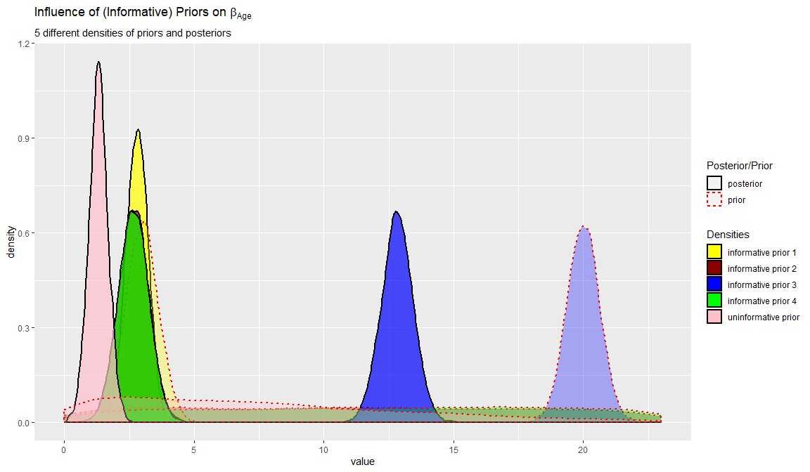

This tutorial provides the reader with a basic tutorial how to perform a **Bayesian regression** in [Blavaan](https://faculty.missouri.edu/~merklee/blavaan/),  using Stan instead of Jags as the MCMC sampler. You can find the Blavaan Jags tutorial [here](https://www.rensvandeschoot.com/tutorials/bayesian-regression-blavaan/). We will not delve into the the differences between Stan and Jags here (a technical explanation can be found [here](http://www.jmlr.org/papers/volume15/hoffman14a/hoffman14a.pdf) and a more accessible blog post [here](https://statmodeling.stat.columbia.edu/2017/11/30/not-compare-speed-stan-something-else/)). For now it suffices to say that Stan is more efficient, especially for complex models. While using Blavaan the biggest difference is how you specify the priors. Instead of using a variance, as in Jags, Stan uses standard deviations.

Throughout this tutorial, the reader will be guided through importing data files, exploring summary statistics and regression analyses. Here, we will exclusively focus on [Bayesian](https://www.rensvandeschoot.com/a-gentle-introduction-to-bayesian-analysis-applications-to-developmental-research/) statistics. 

In this tutorial, we start by using the default prior settings of the software.  In a second step, we will apply user-specified priors, and if you really want to use Bayes for your own data, we recommend to follow the [WAMBS-checklist](https://www.rensvandeschoot.com/wambs-checklist/), also available in other software.

## **Preparation**

This tutorial expects:

- Installation of [STAN](https://mc-stan.org/users/interfaces/rstan) and [Rtools](https://cran.r-project.org/bin/windows/Rtools). For more information please see https://github.com/stan-dev/rstan/wiki/RStan-Getting-Started
- Installation of R packages `rstan`, `lavaan` and `blavaan`. This tutorial was made using Blavaan version 0.3.6 and Lavaan version 0.6.5 in R version 3.6.1
- Basic knowledge of hypothesis testing
- Basic knowledge of correlation and regression
- Basic knowledge of [Bayesian](https://www.rensvandeschoot.com/a-gentle-introduction-to-bayesian-analysis-applications-to-developmental-research/) inference
- Basic knowledge of coding in R


## Example Data

The data we will be using for this exercise is based on a study about predicting PhD-delays ([Van de Schoot, Yerkes, Mouw and Sonneveld 2013](http://journals.plos.org/plosone/article?id=10.1371/journal.pone.0068839)).The data can be downloaded [here](https://www.rensvandeschoot.com/wp-content/uploads/2018/10/phd-delays.csv). Among many other questions, the researchers asked the Ph.D. recipients how long it took them to finish their Ph.D. thesis (n=333). It appeared that Ph.D. recipients took an average of 59.8 months (five years and four months) to complete their Ph.D. trajectory. The variable B3_difference_extra measures the difference between planned and actual project time in months (mean=9.97, minimum=-31, maximum=91, sd=14.43). For more information on the sample, instruments, methodology and research context we refer the interested reader to the paper.

For the current exercise we are interested in the question whether age (M = 31.7, SD = 6.86) of the Ph.D. recipients is related to a delay in their project.

The relation between completion time and age is expected to be non-linear. This might be due to that at a certain point in your life (i.e., mid thirties), family life takes up more of your time than when you are in your twenties or when you are older.

So, in our model the $gap$ (*B3_difference_extra*) is the dependent variable and $age$ (*E22_Age*) and $age^2$(*E22_Age_Squared *) are the predictors. The data can be found in the file <span style="color:red"> ` phd-delays.csv` </span>.

  <p>&nbsp;</p>


##### _**Question:** Write down the null and alternative hypotheses that represent this question. Which hypothesis do you deem more likely?_

[expand title="Answer" trigclass="noarrow my_button" targclass="my_content" tag="button"]

$H_0:$ _$age$ is not related to a delay in the PhD projects._

$H_1:$ _$age$ is related to a delay in the PhD projects._ 

$H_0:$ _$age^2$ is not related to a delay in the PhD projects._

$H_1:$ _$age^2$is related to a delay in the PhD projects._ 

[/expand]


  <p>&nbsp;</p>

## Preparation - Importing and Exploring Data


```r
# if you dont have these packages installed yet, please use the install.packages("package_name") command.
library(rstan) 
library(blavaan)
library(psych) #to get some extended summary statistics
library(tidyverse) # needed for data manipulation and plotting
```

You can find the data in the file <span style="color:red"> ` phd-delays.csv` </span>, which contains all variables that you need for this analysis. Although it is a .csv-file, you can directly load it into R using the following syntax:

```r
#read in data
dataPHD <- read.csv2(file="phd-delays.csv")
colnames(dataPHD) <- c("diff", "child", "sex","age","age2")
```


Alternatively, you can directly download them from GitHub into your R work space using the following command:

```r
dataPHD <- read.csv2(file="https://raw.githubusercontent.com/LaurentSmeets/Tutorials/master/Blavaan/phd-delays.csv")
colnames(dataPHD) <- c("diff", "child", "sex","age","age2")
```

GitHub is a platform that allows researchers and developers to share code, software and research and to collaborate on projects (see https://github.com/)

Once you loaded in your data, it is advisable to check whether your data import worked well. Therefore, first have a look at the summary statistics of your data. you can do this by using the  `describe()` function.

##### _**Question:** Have all your data been loaded in correctly? That is, do all data points substantively make sense? If you are unsure, go back to the .csv-file to inspect the raw data._

[expand title="Answer" trigclass="noarrow my_button" targclass="my_content" tag="button"]


```r
describe(dataPHD)
```

```
##       vars   n    mean     sd median trimmed    mad min  max range  skew
## diff     1 333    9.97  14.43      5    6.91   7.41 -31   91   122  2.21
## child    2 333    0.18   0.38      0    0.10   0.00   0    1     1  1.66
## sex      3 333    0.52   0.50      1    0.52   0.00   0    1     1 -0.08
## age      4 333   31.68   6.86     30   30.39   2.97  26   80    54  4.45
## age2     5 333 1050.22 656.39    900  928.29 171.98 676 6400  5724  6.03
##       kurtosis    se
## diff      5.92  0.79
## child     0.75  0.02
## sex      -2.00  0.03
## age      24.99  0.38
## age2     42.21 35.97
```

_The descriptive statistics make sense:_

_diff: Mean (9.97), SE (0.79)_

_$Age$: Mean (31.68), SE (0.38)_

_$Age^2$: Mean (1050.22), SE (35.97)_

[/expand]

  <p>&nbsp;</p>

## plot

Before we continue with analyzing the data we can also plot the expected relationship.


```r
dataPHD %>%
  ggplot(aes(x = age,
             y = diff)) +
  geom_point(position = "jitter",
             alpha    = .6)+ #to add some random noise for plotting purposes
  theme_minimal()+
  geom_smooth(method = "lm",  # to add  the linear relationship
              aes(color = "linear"),
              se = FALSE) +
  geom_smooth(method = "lm",
              formula = y ~ x + I(x^2),# to add  the quadratic relationship
              aes(color = "quadratic"),
              se = FALSE) +
  labs(title    = "Delay vs. age",
       subtitle = "There seems to be some quadratic relationship",
       x        = "Age",
       y        = "Delay",
       color    = "Type of relationship" ) +
  theme(legend.position = "bottom")
```

<!-- -->


## Regression - Default Priors

In this exercise you will investigate the impact of Ph.D. students&#39; $age$ and $age^2$ on the delay in their project time, which serves as the outcome variable using a regression analysis (note that we ignore assumption checking!).


As you know, Bayesian inference consists of combining a prior distribution with the likelihood obtained from the data. Specifying a prior distribution is one of the most crucial points in Bayesian inference and should be treated with your highest attention (for a quick refresher see e.g.  [Van de Schoot et al. 2017](http://onlinelibrary.wiley.com/doi/10.1111/cdev.12169/abstract)). In this tutorial, we will first rely on the default prior settings, thereby behaving a &#39;naive&#39; Bayesians (which might [not](https://www.rensvandeschoot.com/analyzing-small-data-sets-using-bayesian-estimation-the-case-of-posttraumatic-stress-symptoms-following-mechanical-ventilation-in-burn-survivors/) always be a good idea).

To run a multiple regression with Blavaan, you first specify the model, then fit the model and finally acquire the summary (similar to the frequentist model in Lavaan). The model is specified as follows:

1.  A dependent variable we want to predict.
2.  A "~", that we use to indicate that we now give the other variables of interest.
    (comparable to the '=' of the regression equation).
3.  The different independent variables separated by the summation symbol '+'.
4.  Finally, we insert that the dependent variable has a variance and that we
    want an intercept.

For more information on the basics of (b)lavaan, see their [website](http://lavaan.ugent.be/tutorial/index.html) 

  <p>&nbsp;</p>

The following code is how to specify the regression model:

```r
# 1) specify the model
model.regression <- '#the regression model
                    diff ~ age + age2

                    #show that dependent variable has variance
                    diff ~~ diff

                    #we want to have an intercept
                    diff ~ 1'
```

Then, we need to fit the model by using the following code: We specify `target = "stan"` to tell Blavaan to use the Stan instead of the Jags compiler. 


```r
fit.bayes <- blavaan(model = model.regression, data = dataPHD, test = "none", target = "stan",  seed = 1234,   bcontrol = list(cores = 4))
# the test = "none" input stops the calculations of some posterior checks, we do not need at this moment and speeds up the process. 
# we set a seed for reproducibility. 
# we make optimal use of the number of cores of modern laptops we set the bcontrol = list(cores = 4)) command
```


Now we will have a look at the summary by using `summary(fit.bayes)`.

[expand title="Show Output" trigclass="noarrow my_button" targclass="my_content" tag="button"]


```r
summary(fit.bayes)
```

```
## blavaan (0.3-6) results of 1000 samples after 500 adapt/burnin iterations
## 
##   Number of observations                           333
## 
##   Number of missing patterns                         1
## 
##   Statistic                               
##   Value                                   
## 
## Regressions:
##                    Estimate    Post.SD  HPD.025    HPD.975       PSRF
##   diff ~                                                             
##     age                 1.303    0.367      0.569      2.026    1.006
##     age2               -0.012    0.004      -0.02     -0.004    1.005
##     Prior       
##                 
##     normal(0,10)
##     normal(0,10)
## 
## Intercepts:
##                    Estimate    Post.SD  HPD.025    HPD.975       PSRF
##    .diff              -18.383    7.617    -33.714      -3.29    1.005
##     Prior       
##     normal(0,10)
## 
## Variances:
##                    Estimate    Post.SD  HPD.025    HPD.975       PSRF
##    .diff              196.232   14.716    168.882    225.863    1.001
##     Prior       
##  gamma(1,.5)[sd]
```
[/expand]


  <p>&nbsp;</p> 

The results that stem from a Bayesian analysis are genuinely different from those that are provided by a frequentist model. 

[expand title=Read more on the Bayesian analysis]

The key difference between Bayesian statistical inference and frequentist statistical methods concerns the nature of the unknown parameters that you are trying to estimate. In the frequentist framework, a parameter of interest is assumed to be unknown, but fixed. That is, it is assumed that in the population there is only one true population parameter, for example, one true mean or one true regression coefficient. In the Bayesian view of subjective probability, all unknown parameters are treated as uncertain and therefore are be described by a probability distribution. Every parameter is unknown, and everything unknown receives a distribution.


This is why in frequentist inference, you are primarily provided with a point estimate of the unknown but fixed population parameter. This is the parameter value that, given the data, is most likely in the population. An accompanying confidence interval tries to give you further insight in the uncertainty that is attached to this estimate. It is important to realize that a confidence interval simply constitutes a simulation quantity. Over an infinite number of samples taken from the population, the procedure to construct a (95%) confidence interval will let it contain the true population value 95% of the time. This does not provide you with any information how probable it is that the population parameter lies within the confidence interval boundaries that you observe in your very specific and sole sample that you are analyzing. 

In Bayesian analyses, the key to your inference is the parameter of interest&#39;s posterior distribution. It fulfills every property of a probability distribution and quantifies how probable it is for the population parameter to lie in certain regions. On the one hand, you can characterize the posterior by its mode. This is the parameter value that, given the data and its prior probability, is most probable in the population. Alternatively, you can use the posterior&#39;s mean or median. Using the same distribution, you can construct a 95% credibility interval, the counterpart to the confidence interval in frequentist statistics. Other than the confidence interval, the Bayesian counterpart directly quantifies the probability that the population value lies within certain limits. There is a 95% probability that the parameter value of interest lies within the boundaries of the 95% credibility interval. Unlike the confidence interval, this is not merely a simulation quantity, but a concise and intuitive probability statement. For more on how to interpret Bayesian analysis, check [Van de Schoot et al. 2014](http://onlinelibrary.wiley.com/doi/10.1111/cdev.12169/abstract).

[/expand]

  <p>&nbsp;</p> 

##### _**Question:** Interpret the estimated effect, its interval and the posterior distribution._

[expand title="Answer" trigclass="noarrow my_button" targclass="my_content" tag="button"]


_$Age$ seems to be a relevant predictor of PhD delays, with a posterior mean regression coefficient of 1.303, 95% HPD (Credibility Interval) [0.569 2.026]. Also, $age^2$ seems to be a relevant predictor of PhD delays, with a posterior mean of -0.012, and a 95% Credibility Interval of [-0.02 -0.004]. The 95% HPD shows that there is a 95% probability that these regression coefficients in the population lie within the corresponding intervals, see also the posterior distributions in the figures below. Since 0 is not contained in the Credibility Interval we can be fairly sure there is an effect._


[/expand]

  <p>&nbsp;</p> 

##### _**Question:** Every Bayesian model uses a prior distribution. Describe the shape of the prior distributions of the regression coefficients._

[expand title="Answer" trigclass="noarrow my_button" targclass="my_content" tag="button"]


To check which default priors are being used by Blavaan, you can use the `dpriors()` command. 


```r
dpriors(target = "stan")
```

```
##                nu             alpha            lambda              beta 
##    "normal(0,32)"    "normal(0,10)"    "normal(0,10)"    "normal(0,10)" 
##             theta               psi               rho             ibpsi 
## "gamma(1,.5)[sd]" "gamma(1,.5)[sd]"       "beta(1,1)" "wishart(3,iden)" 
##               tau             delta 
## "normal(0,10^.5)" "gamma(1,.5)[sd]"
```


_As you might have noticed, the parameter estimates from Blavaan are substantively different from the frequentist approach. This is due to the fact that Blavaan (Stan) by default places quite informative priors on the model ($\mathcal{N}(0, 10)$ for the regression coefficients). This prior means that, using the properties of a normal distribution, you are approximately 95% sure that your regression coefficients (including the intercept) are between -20 and 20. Blavaan expects the data to be standardized, which this data is not. For standardized data, these priors can be considered uninformative, but for our data not. The lesson to take home from this is, that you can never fully trust default priors of any software The same model with actually uninformative ($\mathcal{N}(0, 10000)$) priors would yield these results:_


```r
my_priors <- dpriors(target = "stan", beta = "normal(0,10000)", alpha= "normal(0,10000)")

fit.bayes_uninf <- blavaan(model = model.regression, data = dataPHD, test = "none", target = "stan",  seed = 1234,   bcontrol = list(cores = 4), dp = my_priors)
```


```r
summary(fit.bayes_uninf)
```

```
## blavaan (0.3-6) results of 1000 samples after 500 adapt/burnin iterations
## 
##   Number of observations                           333
## 
##   Number of missing patterns                         1
## 
##   Statistic                               
##   Value                                   
## 
## Regressions:
##                    Estimate    Post.SD  HPD.025    HPD.975       PSRF
##   diff ~                                                             
##     age                 2.661    0.602      1.516      3.911    1.005
##     age2               -0.026    0.006     -0.039     -0.014    1.005
##     Prior       
##                 
##  normal(0,10000)
##  normal(0,10000)
## 
## Intercepts:
##                    Estimate    Post.SD  HPD.025    HPD.975       PSRF
##    .diff              -47.144   12.679    -73.665    -22.883    1.004
##     Prior       
##  normal(0,10000)
## 
## Variances:
##                    Estimate    Post.SD  HPD.025    HPD.975       PSRF
##    .diff              194.304   15.301    167.047    225.294    0.999
##     Prior       
##  gamma(1,.5)[sd]
```


[/expand]

  <p>&nbsp;</p> 


## Regression - User-specified Priors

In Blavaan, you can also manually specify your prior distributions. Be aware that usually, this has to be done BEFORE peeking at the data, otherwise you are double-dipping (!). In theory, you can specify your prior knowledge using any kind of distribution you like. However, if your prior distribution does not follow the same parametric form as your likelihood, calculating the model can be computationally intense. _Conjugate_ priors avoid this issue, as they take on a functional form that is suitable for the model that you are constructing. For your normal linear regression model, conjugacy is reached if the priors for your regression parameters are specified using normal distributions (the residual variance receives an inverse gamma distribution, which is neglected here). In Blavaan, you are quite flexible in the specification of informative priors.

Let&#39;s re-specify the regression model of the exercise above, using conjugate priors. We leave the priors for the intercept and the residual variance untouched for the moment. Regarding your regression parameters, you need to specify the hyperparameters of their normal distribution, which are the mean and the variance. The mean indicates which parameter value you deem most likely. The variance expresses how certain you are about that. We try 4 different prior specifications, for both the $\beta_{age}$ regression coefficient, and the $\beta_{age^2}$ coefficient.

First, we use the following prior specifications:

_$Age$ ~  $\mathcal{N}(3, 0.4)$_

_$Age^2$ ~  $\mathcal{N}(0, 0.1)$_

_$intercept$ ~  $\mathcal{N}(0, 10000)$_ (non-informative)

In Blavaan, the priors are set in the model formulation step. Be careful, Stan uses standard deviations instead of variance in the normal distribution. The standard deviations is the square root of the variance, so a variance of 0.1 corresponds to a standard deviation of 0.316 and a variance of 0.4 corresponds to a standard deviation of 0.632.

The priors are presented in code as follows:


```r
model.informative.priors1 <- 
                    '#the regression model with priors
                    diff ~ prior("normal(3, 0.632)")*age + prior("normal(0, 0.316 )")*age2

                    #show that dependent variable has variance
                    diff ~~ diff

                    #we want to have an intercept (with normal prior)
                    diff ~  prior("normal(0, 10000)")*1'
```

Now fit the model and request for summary statistics. 

[expand title="Answer" trigclass="noarrow my_button" targclass="my_content" tag="button"]


```r
fit.bayes.infprior1 <- blavaan(model  = model.informative.priors1, data = dataPHD,
                               test   = "none",  target = "stan",
                               burnin = 1000, sample = 5000, seed = 123,
                               bcontrol = list(cores = 4))
# instead of relying on the default settings, we now specify the number of iterations and length of burnin period
```


```r
summary(fit.bayes.infprior1, fit.measures = TRUE, ci = TRUE, rsquare = TRUE)
```

```
## blavaan (0.3-6) results of 5000 samples after 1000 adapt/burnin iterations
## 
##   Number of observations                           333
## 
##   Number of missing patterns                         1
## 
##   Statistic                               
##   Value                                   
## 
## Regressions:
##                    Estimate    Post.SD  HPD.025    HPD.975       PSRF
##   diff ~                                                             
##     age                 2.791    0.420      1.963      3.592    1.001
##     age2               -0.027    0.004     -0.036     -0.018    1.001
##     Prior       
##                 
##  normal(3,0.632)
##  normal(0,0.316)
## 
## Intercepts:
##                    Estimate    Post.SD  HPD.025    HPD.975       PSRF
##    .diff              -49.884    8.869    -66.875    -32.229    1.001
##     Prior       
##  normal(0,10000)
## 
## Variances:
##                    Estimate    Post.SD  HPD.025    HPD.975       PSRF
##    .diff              193.971   14.895     167.15    225.295    1.000
##     Prior       
##  gamma(1,.5)[sd]
## 
## R-Square:
##                    Estimate  
##     diff                0.068
```


[/expand]


#### _**Question** Fill in the results in the table below:_


| $Age$          | Default prior              |$\mathcal{N}(3, .4)$| $\mathcal{N}(3, 1000)$|$\mathcal{N}(20, .4)$|$\mathcal{N}(20, 1000)$|
| ---            | ---                        | ---                    | ---        |---         | ---         |
| Posterior mean |  1.303|                        |            |            |             | 
| Posterior sd   |  0.367|                        |            |            |             |

| $Age^2$        | Default prior             | $\mathcal{N}(0, .1)$   |  $\mathcal{N}(0, 1000)$ |  $\mathcal{N}(20, .1)$|  $\mathcal{N}(20, 1000)$ |
| ---            | ---                       | ---       | ---        | ---        | ---         |
| Posterior mean | -0.012|           |            |            |             |
| Posterior sd   | 0.004|           |            |            |             |


[expand title="Answer" trigclass="noarrow my_button" targclass="my_content" tag="button"]


| $Age$          | Default prior              |$\mathcal{N}(3, .4)$| $\mathcal{N}(3, 1000)$|$\mathcal{N}(20, .4)$|$\mathcal{N}(20, 1000)$|
| ---            | ---                        | ---                      | ---        |---         | ---         |
| Posterior mean |  1.303|2.791|            |            |             | 
| Posterior sd   |  0.367|0.42|            |            |             |

| $Age^2$        | Default prior              | $\mathcal{N}(0, .1)$      |  $\mathcal{N}(0, 1000)$ |  $\mathcal{N}(20, .1)$|  $\mathcal{N}(20, 1000)$ |
| ---            | ---                        | ---                       | ---        | ---        | ---         |
| Posterior mean | -0.012 | -0.027|            |            |             |
| Posterior sd   | 0.004 | 0.004|            |            |             |


[/expand]

Next, try to adapt the code, using the prior specifications of the other columns and then complete the table.


[expand title="Answer" trigclass="noarrow my_button" targclass="my_content" tag="button"]


```r
model.informative.priors2 <- 
                    '#the regression model with priors
                    diff ~ prior("normal(3, 31.6)")*age + prior("normal(0,  31.6)")*age2

                    #show that dependent variable has variance
                    diff ~~ diff

                    #we want to have an intercept (with normal prior)
                    diff ~ prior("normal(0, 10000)")*1'
```


```r
model.informative.priors3 <- 
                    '#the regression model with priors
                    diff ~ prior("normal(20, 0.632)")*age + prior("normal(20, 0.316)")*age2

                    #show that dependent variable has variance
                    diff ~~ diff

                    #we want to have an intercept (with normal prior)
                    diff ~ prior("normal(0, 10000)")*1'
```


```r
model.informative.priors4 <- 
                    '#the regression model with priors
                    diff ~ prior("normal(20, 31.6)")*age + prior("normal(20,  31.6)")*age2

                    #show that dependent variable has variance
                    diff ~~ diff

                    #we want to have an intercept (with normal prior)
                    diff ~ prior("normal(0, 10000)")*1'
```


```r
fit.bayes.infprior2 <- blavaan(model = model.informative.priors2, data = dataPHD,  test = "none",  target = "stan", burnin = 1000, sample = 5000, seed = 12345, bcontrol = list(cores = 4))
fit.bayes.infprior3 <- blavaan(model = model.informative.priors3, data = dataPHD,  test = "none",  target = "stan", burnin = 1000, sample = 5000, seed = 12345, bcontrol = list(cores = 4))
fit.bayes.infprior4 <- blavaan(model = model.informative.priors4, data = dataPHD,  test = "none",  target = "stan", burnin = 1000, sample = 5000, seed = 12345, bcontrol = list(cores = 4))
```


```r
summary(fit.bayes.infprior2, fit.measures = TRUE, ci = TRUE, rsquare = TRUE)
```

```
## blavaan (0.3-6) results of 5000 samples after 1000 adapt/burnin iterations
## 
##   Number of observations                           333
## 
##   Number of missing patterns                         1
## 
##   Statistic                               
##   Value                                   
## 
## Regressions:
##                    Estimate    Post.SD  HPD.025    HPD.975       PSRF
##   diff ~                                                             
##     age                 2.664    0.586      1.507      3.816    1.001
##     age2               -0.026    0.006     -0.038     -0.014    1.001
##     Prior       
##                 
##   normal(3,31.6)
##   normal(0,31.6)
## 
## Intercepts:
##                    Estimate    Post.SD  HPD.025    HPD.975       PSRF
##    .diff              -47.231   12.354    -71.444    -22.918    1.001
##     Prior       
##  normal(0,10000)
## 
## Variances:
##                    Estimate    Post.SD  HPD.025    HPD.975       PSRF
##    .diff              193.934   15.095    166.871    226.205    1.001
##     Prior       
##  gamma(1,.5)[sd]
## 
## R-Square:
##                    Estimate  
##     diff                0.063
```

```r
summary(fit.bayes.infprior3, fit.measures = TRUE, ci = TRUE, rsquare = TRUE)
```

```
## blavaan (0.3-6) results of 5000 samples after 1000 adapt/burnin iterations
## 
##   Number of observations                           333
## 
##   Number of missing patterns                         1
## 
##   Statistic                               
##   Value                                   
## 
## Regressions:
##                    Estimate    Post.SD  HPD.025    HPD.975       PSRF
##   diff ~                                                             
##     age                12.826    0.610      11.62     14.034    1.001
##     age2               -0.130    0.006     -0.142     -0.117    1.001
##     Prior        
##                  
##  normal(20,0.632)
##  normal(20,0.316)
## 
## Intercepts:
##                    Estimate    Post.SD  HPD.025    HPD.975       PSRF
##    .diff             -260.252   12.937   -285.954   -234.898    1.001
##     Prior        
##   normal(0,10000)
## 
## Variances:
##                    Estimate    Post.SD  HPD.025    HPD.975       PSRF
##    .diff              368.405   36.081    303.957    445.971    1.001
##     Prior        
##   gamma(1,.5)[sd]
## 
## R-Square:
##                    Estimate  
##     diff                0.435
```

```r
summary(fit.bayes.infprior4, fit.measures = TRUE, ci = TRUE, rsquare = TRUE)
```

```
## blavaan (0.3-6) results of 5000 samples after 1000 adapt/burnin iterations
## 
##   Number of observations                           333
## 
##   Number of missing patterns                         1
## 
##   Statistic                               
##   Value                                   
## 
## Regressions:
##                    Estimate    Post.SD  HPD.025    HPD.975       PSRF
##   diff ~                                                             
##     age                 2.653    0.580      1.519      3.779    1.001
##     age2               -0.026    0.006     -0.038     -0.014    1.001
##     Prior       
##                 
##  normal(20,31.6)
##  normal(20,31.6)
## 
## Intercepts:
##                    Estimate    Post.SD  HPD.025    HPD.975       PSRF
##    .diff              -47.004   12.205    -70.706    -23.033    1.001
##     Prior       
##  normal(0,10000)
## 
## Variances:
##                    Estimate    Post.SD  HPD.025    HPD.975       PSRF
##    .diff              193.701   14.774    166.904     224.64    1.000
##     Prior       
##  gamma(1,.5)[sd]
## 
## R-Square:
##                    Estimate  
##     diff                0.063
```


  
| $Age$          | Default prior              |$\mathcal{N}(3, .4)$      | $\mathcal{N}(3, 1000)$    |$\mathcal{N}(20, .4)$    |$\mathcal{N}(20, 1000)$   |
| ---            | ---                        | ---                      | ---                       |---                       | ---                      |
| Posterior mean |  1.303|2.791| 2.664|12.826|2.653| 
| Posterior sd   |  0.367|0.42| 0.586|0.61|0.58|

| $Age^2$        | Default prior              | $\mathcal{N}(0, .1)$      |  $\mathcal{N}(0, 1000)$ |  $\mathcal{N}(20, .1)$|  $\mathcal{N}(20, 1000)$ |
| ---            | ---                        | ---                       | ---                        | ---                      | ---                      |
| Posterior mean | -0.012 | -0.027|-0.026  |-0.13|-0.026|
| Posterior sd   | 0.004 | 0.004|0.006  |0.006|0.006|

[/expand]


#### _**Question**: Compare the results over the different prior specifications. Are the results comparable with the default model?_

#### _**Question**: Do we end up with similar conclusions, using different prior specifications?_

To answer these questions, proceed as follows:
We can calculate the relative bias to express this difference. ($bias= 100*\frac{(model \; informative \; priors\; - \; model \; uninformed  \;priors)}{model \; uninformative \; priors}$). In order to preserve clarity we will just calculate the bias of the two regression coefficients and only compare the default (uninformative) model with the model that uses the $\mathcal{N}(20, .4)$ and $\mathcal{N}(20, .1)$ priors. Copy Paste the following code to R:


```r
#1) ask for the posterior means
posterior_mean <- blavInspect(fit.bayes, what = "postmean")
posterior_mean_informative <- blavInspect(fit.bayes.infprior3, what = "postmean")

#2) ask for the mean (estimate) of the regression coefficients
estimatesuninformative <- posterior_mean[1:2]
estimatesinformative   <- posterior_mean_informative[1:2]

#3) calculate the bias
round(100*((estimatesinformative-estimatesuninformative)/estimatesuninformative), 2)
```


The `diff~age ` and `diff~age2 ` indices stand for the $\beta_{age}$ and $\beta_{age^2}$ respectively. These somewhat confusing indices are what Blavaan receives from the MCMC sampler in Stan These are just the labels Stan gives to the parameters and Blavaan doesn't really translate them back to the input names we gave them. 

<!-- There is some order to it though. Beta[x,x,x] are regression coefficients (in the order we specified them in the model, so first $age$ and then $age^2$), alpha[x,x,x] are intercepts, psi[x,x,x] are variances, and def[x,x,x] are indirect effects (if you have those in your model). They are listed in the same order as they are in the `summary()` output. So first regression coefficients, then intercepts, then (co)variances, and then indirect effects.  -->

We can also plot these differences by plotting both the posterior and priors for the five different models we ran. In this example we only plot the regression of coefficient of age $\beta_{age}$.

First we extract the MCMC chains of the 5 different models for only this one parameter ($\beta_{age}$=`bet_sign[1]`). Copy-paste the following code to R: 

[expand title="Show Syntax" trigclass="noarrow my_button" targclass="my_content" tag="button"]


```r
posterior1.2.3.4.5 <- bind_rows("uninformative prior" = enframe(as.matrix(blavInspect(fit.bayes, what="mcmc"))[,'bet_sign[1]']),
                                "informative prior 1" = enframe(as.matrix(blavInspect(fit.bayes.infprior1, what="mcmc"))[,'bet_sign[1]']),
                                "informative prior 2" = enframe(as.matrix(blavInspect(fit.bayes.infprior2, what="mcmc"))[,'bet_sign[1]']),
                                "informative prior 3" = enframe(as.matrix(blavInspect(fit.bayes.infprior3, what="mcmc"))[,'bet_sign[1]']),
                                "informative prior 4" = enframe(as.matrix(blavInspect(fit.bayes.infprior4, what="mcmc"))[,'bet_sign[1]']),
                                .id = "id1")  

prior1.2.3.4.5 <- bind_rows("uninformative prior" = enframe(rnorm(10000, mean=0, sd=sqrt(1/1e-2))),
                            "informative prior 1" = enframe(rnorm(10000, mean=3, sd=sqrt(0.4))),
                            "informative prior 2" = enframe(rnorm(10000, mean=3, sd=sqrt(1000))),
                            "informative prior 3" = enframe(rnorm(10000, mean=20, sd=sqrt(0.4))),
                            "informative prior 4" = enframe(rnorm(10000, mean=20, sd=sqrt(1000))),
                          .id= "id1")# here we sample a large number of values from the prior distributions to be able to plot them.

priors.posterior <- bind_rows("posterior" = posterior1.2.3.4.5, "prior" = prior1.2.3.4.5,  .id = "id2")
```

*In older versions of Blavaan, please use `beta[1,2,1]` instead of `bet_sign[1]` to select the right posterior*

[/expand]

Then, we can plot the different posteriors and priors by using the following code:

[expand title="Show Syntax" trigclass="noarrow my_button" targclass="my_content" tag="button"]


```r
ggplot(data    = priors.posterior, 
       mapping = aes(x        = value,
                     fill     = id1,
                     colour   = id2,
                     linetype = id2, 
                     alpha    = id2))+
  geom_density(size = 1)+
  scale_x_continuous(limits  = c(0, 23))+
  scale_colour_manual(name   = 'Posterior/Prior', values = c("black","red"),    labels = c("posterior", "prior"))+
  scale_linetype_manual(name = 'Posterior/Prior', values = c("solid","dotted"), labels = c("posterior", "prior"))+
  scale_alpha_discrete(name  = 'Posterior/Prior', range  = c(.7,.3),            labels = c("posterior", "prior"))+
  scale_fill_manual(name = "Densities", values = c("Yellow","darkred","blue", "green", "pink"))+
  labs(title    = expression("Influence of (Informative) Priors on" ~ beta[Age]), 
       subtitle = "5 different densities of priors and posteriors")
```

<!-- -->
[/expand]

Now, with the information from the table, the bias estimates and the plot you can answer the two questions about the influence of the priors on the results. 

[expand title="Answer" trigclass="noarrow my_button" targclass="my_content" tag="button"]


```r
#1) ask for the posterior means
posterior_mean <- blavInspect(fit.bayes, what = "postmean")
posterior_mean_informative <- blavInspect(fit.bayes.infprior3, what = "postmean")

#2) ask for the mean (estimate) of the regression coefficients
estimatesuninformative <- posterior_mean[1:2]
estimatesinformative   <- posterior_mean_informative[1:2]

#3) calculate the bias
round(100*((estimatesinformative-estimatesuninformative)/estimatesuninformative), 2)
```

```
##  diff~age diff~age2 
##    884.08    960.81
```


_We see that the influence of this highly informative prior is around 884% and 961% on the two regression coefficients respectively. This is a large difference and we thus certainly would not end up with similar conclusions._

_The results change with different prior specifications, but are still comparable. Only using $\mathcal{N}(20, .4)$ for age, results in a really different coefficients, since this prior mean is far from the mean of the data, while its variance is quite certain. However, in general the other results are comparable. Because we use a big dataset the influence of the prior is relatively small. If one would use a smaller dataset the influence of the priors are larger. To check this you can use these lines to sample roughly 20% of all cases and redo the same analysis. The results will of course be different because we use many fewer cases (probably too few!). Use this code._


```r
indices <- sample.int(333, 60)
smalldata <- dataPHD[indices,]
```

_We made a new dataset with randomly chosen 60 of the 333 observations from the original dataset. You can repeat the analyses with the same code and only changing the name of the dataset to see the influence of priors on a smaller dataset. Run the model model.informative.priors2 with this new dataset_ 


```r
fit.bayes.infprior2_small <- blavaan(model.informative.priors2, data = smalldata, test = "none",  target = "stan", burnin = 1000, sample = 5000, seed = 123)
summary(fit.bayes.infprior2_small, fit.measures = TRUE, ci = TRUE, rsquare = TRUE)
```

[/expand]

If you really want to use Bayes for your own data, we recommend to follow the [WAMBS-checklist](https://www.rensvandeschoot.com/wambs-checklist/), which you are guided through by this exercise.

--- 
### **References**

_Benjamin, D. J., Berger, J., Johannesson, M., Nosek, B. A., Wagenmakers, E.,... Johnson, V. (2017, July 22)._ [Redefine statistical significance](https://psyarxiv.com/mky9j)_. Retrieved from psyarxiv.com/mky9j_

_Greenland, S., Senn, S. J., Rothman, K. J., Carlin, J. B., Poole, C., Goodman, S. N. Altman, D. G. (2016)._ [Statistical tests, P values, confidence intervals, and power: a guide to misinterpretations](https://link.springer.com/article/10.1007/s10654-016-0149-3)_._ _European Journal of Epidemiology 31 (4_). [_https://doi.org/10.1007/s10654-016-0149-3_](https://doi.org/10.1007/s10654-016-0149-3) 

_Hoffman, M. D., & Gelman, A. (2014)_. The No-U-turn sampler: adaptively setting path lengths in Hamiltonian Monte Carlo. Journal of Machine Learning Research, 15(1), 1593-1623.

_Rosseel, Y. (2012)._ [lavaan: An R Package for Structural Equation Modeling](https://www.jstatsoft.org/article/view/v048i02). _Journal of Statistical Software, 48(2), 1-36. _

_van de Schoot R, Yerkes MA, Mouw JM, Sonneveld H (2013)_ [What Took Them So Long? Explaining PhD Delays among Doctoral Candidates](http://journals.plos.org/plosone/article?id=10.1371/journal.pone.0068839)_._ _PLoS ONE 8(7): e68839._ [https://doi.org/10.1371/journal.pone.0068839](https://doi.org/10.1371/journal.pone.0068839)

_Trafimow D, Amrhein V, Areshenkoff CN, Barrera-Causil C, Beh EJ, Bilgi? Y, Bono R, Bradley MT, Briggs WM, Cepeda-Freyre HA, Chaigneau SE, Ciocca DR, Carlos Correa J, Cousineau D, de Boer MR, Dhar SS, Dolgov I, G?mez-Benito J, Grendar M, Grice J, Guerrero-Gimenez ME, Guti?rrez A, Huedo-Medina TB, Jaffe K, Janyan A, Karimnezhad A, Korner-Nievergelt F, Kosugi K, Lachmair M, Ledesma R, Limongi R, Liuzza MT, Lombardo R, Marks M, Meinlschmidt G, Nalborczyk L, Nguyen HT, Ospina R, Perezgonzalez JD, Pfister R, Rahona JJ, Rodr?guez-Medina DA, Rom?o X, Ruiz-Fern?ndez S, Suarez I, Tegethoff M, Tejo M, ** van de Schoot R** , Vankov I, Velasco-Forero S, Wang T, Yamada Y, Zoppino FC, Marmolejo-Ramos F. (2017)_  [Manipulating the alpha level cannot cure significance testing - comments on &quot;Redefine statistical significance&quot;](https://www.rensvandeschoot.com/manipulating-alpha-level-cannot-cure-significance-testing/) PeerJ reprints 5:e3411v1   [https://doi.org/10.7287/peerj.preprints.3411v1](https://doi.org/10.7287/peerj.preprints.3411v1)


