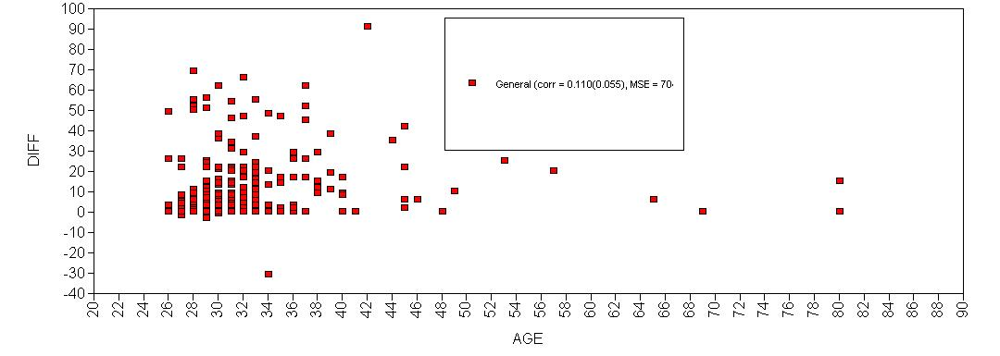

## Introduction
This tutorial provides the reader with a basic tutorial how to perform a regression analysis in [Mplus](https://www.statmodel.com/). Throughout this tutorial, the reader will be guided through importing datafiles, exploring summary statistics and regression analyses. Here, we will exclusively focus on [frequentist statistics](https://www.rensvandeschoot.com/a-gentle-introduction-to-bayesian-analysis-applications-to-developmental-research/). 

  <p>&nbsp;</p>

## Preparation
This tutorial expects:

- any version of [Mplus](https://sourceforge.net/projects/mcmc-jags/files/latest/download?source=files).This tutorial was made using Mplus version 8_3.
- Basic knowledge of hypothesis testing
- Basic knowledge of correlation and regression
- Basic knowledge of coding in Mplus


## Example Data

The data we will be using for this exercise is based on a study about predicting PhD-delays ([Van de Schoot, Yerkes, Mouw and Sonneveld 2013](http://journals.plos.org/plosone/article?id=10.1371/journal.pone.0068839)).The data can be downloaded [here](https://www.rensvandeschoot.com/wp-content/uploads/2018/10/phd-delays_nonames.csv). Among many other questions, the researchers asked the Ph.D. recipients how long it took them to finish their Ph.D. thesis (n=333). It appeared that Ph.D. recipients took an average of 59.8 months (five years and four months) to complete their Ph.D. trajectory. The variable B3_difference_extra measures the difference between planned and actual project time in months (mean=9.97, minimum=-31, maximum=91, sd=14.43). For more information on the sample, instruments, methodology and research context we refer the interested reader to the paper.

For the current exercise we are interested in the question whether age (M = 31.7, SD = 6.86) of the Ph.D. recipients is related to a delay in their project.

The relation between completion time and age is expected to be non-linear. This might be due to that at a certain point in your life (i.e., mid thirties), family life takes up more of your time than when you are in your twenties or when you are older.

So, in our model the $gap$ (*B3_difference_extra*) is the dependent variable and $age$ (*E22_Age*) and $age^2$(*E22_Age_Squared *) are the predictors. The data can be found in the file <span style="color:red"> ` phd-delays_nonames.csv` </span>. (In Mplus the first row CANNOT have the variable names, these have already been deleted for you)
  <p>&nbsp;</p>


##### _**Question:** Write down the null and alternative hypotheses that represent this question. Which hypothesis do you deem more likely?_

[expand title="Answer" trigclass="noarrow my_button" targclass="my_content" tag="button"]

$H_0:$ _$age$ is not related to a delay in the PhD projects._

$H_1:$ _$age$ is related to a delay in the PhD projects._ 

$H_0:$ _$age^2$ is not related to a delay in the PhD projects._

$H_1:$ _$age^2$is related to a delay in the PhD projects._ 

[/expand]


  <p>&nbsp;</p>

## Preparation - Importing and Exploring Data


You can find the data in the file <span style="color:red"> ` phd-delays_nonames.csv` </span>, which contains all variables that you need for this analysis. Although it is a .csv-file, you can directly load it into Mplus using the following syntax:


```r
TITLE: Mplus analysis summary
DATA: FILE IS phd-delays_nonames.csv;
VARIABLE: NAMES ARE diff child sex Age Age2;
USEVARIABLES ARE diff Age Age2;
OUTPUT: sampstat;
```

Once you loaded in your data, it is advisable to check whether your data import worked well. Therefore, first have a look at the summary statistics of your data. You can do this by looking at the `sampstat` ouput. 

<p>&nbsp;</p>

##### _**Question:** Have all your data been loaded in correctly? That is, do all data points substantively make sense? If you are unsure, go back to the .csv-file to inspect the raw data._

[expand title="Answer" trigclass="noarrow my_button" targclass="my_content" tag="button"]


```r
MODEL RESULTS

                                                    Two-Tailed
                    Estimate       S.E.  Est./S.E.    P-Value

 Means
    DIFF               9.967      0.790     12.622      0.000
    AGE               31.676      0.375     84.433      0.000
    AGE2            1050.217     35.916     29.241      0.000
```


_The descriptive statistics make sense:_

_$diff$: Mean (9.97), SE (0.79)_

_$Age$: Mean (31.68), SE (0.38)_

_$Age^2$: Mean (1050.22), SE (35.92)_

[/expand]

## Plot


Before we continue with analyzing the data we can also plot the expected relationship. We can do this by adding the following code to the input syntax of Mplus and then in the top menu go to `Plot` >   `View plot` > `Scatterplots (sample value)` > `View` > `Set X to AGE` > `OK`


```r
PLOT: 
TYPE IS PLOT1; 
```

This gives us the following plot:



There seems to be some quadratic relationship


## Regression Analysis
Now, let's run a multiple regression model predicting the difference between Ph.D. students' planned and actual project time by their age (note that we ignore assumption checking, if you want a quick introduction to the assumptions underlying a regression, please have look at https://statistics.laerd.com/spss-tutorials/linear-regression-using-spss-statistics.php).

To run a multiple regression with Mplus, you first specify the model, then fit
the model and finally acquire the summary. The model is specified as follows:


1. We set a title of the file under the `TITLE:` command
2. We use a `DATA` command and we tell Mplus what the datafile is called. 
3. In the next syntax line, we use a `VARIABLE` command that consists of two lines. First, we tell Mplus what the variable names are by using the `NAMES ARE` statement. Note that the order of the variable names has to mirror the actual order in the dataset. Second, we tell Mplus which variables we are actually going to use by using `USEVARIABLES ARE`. This way Mplus knows which columns in the `.csv` file to use. 
4. We specified a `MODEL` where an outcome variable (diff) is being regressed `ON` two predictors (Age and Age2). Dependent or Y variables always appear on the left hand side of the `ON` statement and independent or X variables always appear on the right hand side of the `ON` statement.
5. We specify what types of output we would like after the `OUTPUT` statement. See [here](https://www.statmodel.com/language.html) for a summary of all possible outputs and syntax


Now, preform a multiple linear regression and answer the following questions:

##### _**Question:** Using a significance criterion of 0.05, is there a significant effect of $age$ and $age^2$?_

[expand title=\"Answer\" trigclass=\"noarrow my_button\" targclass=\"my_content\" tag=\"button\"]
 

```r
TITLE: Frequentist analysis

DATA: FILE IS phd-delays_nonames.csv;

VARIABLE: NAMES ARE diff child sex Age Age2; ! All the variables in the dataset

USEVARIABLES ARE diff Age Age2; ! The variables we use in this analysis

MODEL: 
diff ON Age (Beta_Age);   ! Regression coefficient 1. 
diff ON Age2(Beta_Age2);  ! Regression coefficient 2 

OUTPUT: sampstat;
```


```r
MODEL RESULTS

                                                    Two-Tailed
                    Estimate       S.E.  Est./S.E.    P-Value

 DIFF     ON
    AGE                2.657      0.583      4.554      0.000
    AGE2              -0.026      0.006     -4.236      0.000

 Intercepts
    DIFF             -47.088     12.285     -3.833      0.000

 Residual Variances
    DIFF             194.641     15.084     12.903      0.000
```


_There is a significant effect of $age$ and $age^2$, with b=2.657, p &lt;.001 for $age$, and b=-0.026, p&lt;.001 for $age^2$._

  <p>&nbsp;</p>
  
  
  

_There is a significant effect of $age$ and $age^2$, with b=2.657, p &lt;.001 for $age$, and b=-0.026, p&lt;.001 for $age^2$._


[/expand]

  <p>&nbsp;</p> 


Surveys in academia have shown that a large number of researchers interpret the p-value wrong and misinterpretations are way more widespread than thought. Have a look at the article by [Greenland et al. (2016)](https://link.springer.com/article/10.1007/s10654-016-0149-3) that provides a guide to clear and concise interpretations of p.

  <p>&nbsp;</p> 
  
##### _**Question:** What can you conclude about the hypothesis being tested using the correct interpretation of the p-value?_

[expand title=\"Answer\" trigclass=\"noarrow my_button\" targclass=\"my_content\" tag=\"button\"]

_Assuming that the null hypothesis is true in the population, the probability of obtaining a test statistic that is as extreme or more extreme as the one we observe is &lt;0.1%. Because the effect of $age^2$ is below our pre-determined alpha level, we reject the null hypothesis._

[/expand]

  <p>&nbsp;</p>

Recently, a group of 72 notable statisticians proposed to shift the significance threshold to 0.005 ([Benjamin et al. 2017](https://osf.io/preprints/psyarxiv/mky9j), but see also a critique by[Trafimow, ..., Van de Schoot, et al., 2018](https://www.rensvandeschoot.com/manipulating-alpha-level-cannot-cure-significance-testing/)). They argue that a p-value just below 0.05 does not provide sufficient evidence for statistical inference.


  <p>&nbsp;</p>

##### _**Question:** How does your conclusion change if you follow this advice?_

[expand title=\"Answer\" trigclass=\"noarrow my_button\" targclass=\"my_content\" tag=\"button\"]

_Because the p-values for both regression coefficients were really small &lt;.001, the conclusion doesn&#39;t change in this case._


[/expand]

  <p>&nbsp;</p>


Of course, we should never base our decisions on single criterions only. Luckily, there are several additional measures that we can take into account. A very popular measure is the confidence interval. To get the confidence intervals for the model parameters, you can add `CINTERVAL` to the `OUTPUT` statement in the input file, like


```r
OUTPUT: sampstat CINTERVAL;
```

This will give this output:


```r
CONFIDENCE INTERVALS OF MODEL RESULTS

                  Lower .5%  Lower 2.5%    Lower 5%    Estimate    Upper 5%  Upper 2.5%   Upper .5%

 DIFF     ON
    AGE              1.154       1.514       1.697       2.657       3.617       3.801       4.160
    AGE2            -0.042      -0.038      -0.036      -0.026      -0.016      -0.014      -0.010

 Intercepts
    DIFF           -78.732     -71.167     -67.297     -47.088     -26.880     -23.010     -15.445

 Residual Variances
    DIFF           155.787     165.076     169.827     194.641     219.455     224.207     233.496
```


_$Age$: 95% CI [1.514, 3.801]_

_$Age^2$: 95% CI [-0.038, -0.014]_

_In both cases the 95% CI&#39;s don&#39;t contain 0, which means, the null hypotheses should be rejected. A 95% CI means, that, if infinitely samples were taken from the population, then 95% of the samples contain the true population value. But we do not know whether our current sample is part of this collection, so we only have an aggregated assurance that in the long run if our analysis would be repeated our sample CI contains the true population parameter._


[/expand]


Additionally, to make statements about the actual relevance of your results, focusing on effect size measures is inevitable.

##### _**Question:** What can you say about the relevance of your results? Focus on the explained variance and the standardized regression coefficients._

To get the standardized results and an estimate of the explained variance (R$^2$), you can add `CINTERVAL` to the `OUTPUT` statement in the input file, like


```r
OUTPUT: sampstat CINTERVAL STDYX;
```


[expand title=Answer]


```r
R-SQUARE

    Observed                                        Two-Tailed
    Variable        Estimate       S.E.  Est./S.E.    P-Value

    DIFF               0.063      0.026      2.435      0.015
```


_R$^2$= 0.063 in the regression model. This means that 6.3% of the variance in the PhD delays, can be explained by $age$ and $age^2$._ 


```r
STDYX Standardization

                                                    Two-Tailed
                    Estimate       S.E.  Est./S.E.    P-Value

 DIFF     ON
    AGE                1.262      0.269      4.685      0.000
    AGE2              -1.174      0.271     -4.340      0.000

 Intercepts
    DIFF              -3.268      0.819     -3.992      0.000

 Residual Variances
    DIFF               0.937      0.026     36.472      0.000
```

_The standardized coefficients, age (1.262) and age$^2$ (-1.174), show that the effects of both regression coefficients are comparable, but the effect of age is somewhat higher. This means that the linear effect of age on PhD delay (age) is a bit larger than the quadratic effect of age on PhD delay (age2)_


Only a combination of different measures assessing different aspects of your results can provide a comprehensive answer to your research question.

  <p>&nbsp;</p>


##### _**Question:** Drawing on all the measures we discussed above, formulate an answer to your research question._

[expand title=\"Answer\" trigclass=\"noarrow my_button\" targclass=\"my_content\" tag=\"button\"]

_The variables $age$ and $age^2$ are significantly related to PhD delays. However, the total explained variance by those two predictors is only 6.3%. Therefore, a large part of the variance is still unexplained._

[/expand]
 <p>&nbsp;</p>
 <p>&nbsp;</p>


--- 
### **References**

_Benjamin, D. J., Berger, J., Johannesson, M., Nosek, B. A., Wagenmakers, E.,... Johnson, V. (2017, July 22)._ [Redefine statistical significance](https://psyarxiv.com/mky9j)_. Retrieved from psyarxiv.com/mky9j_

_Greenland, S., Senn, S. J., Rothman, K. J., Carlin, J. B., Poole, C., Goodman, S. N. Altman, D. G. (2016)._ [Statistical tests, P values, confidence intervals, and power: a guide to misinterpretations](https://link.springer.com/article/10.1007/s10654-016-0149-3)_._ _European Journal of Epidemiology 31 (4_). [_https://doi.org/10.1007/s10654-016-0149-3_](https://doi.org/10.1007/s10654-016-0149-3) _   _


_van de Schoot R, Yerkes MA, Mouw JM, Sonneveld H (2013)_ [What Took Them So Long? Explaining PhD Delays among Doctoral Candidates](http://journals.plos.org/plosone/article?id=10.1371/journal.pone.0068839)_._ _PLoS ONE 8(7): e68839._ [https://doi.org/10.1371/journal.pone.0068839](https://doi.org/10.1371/journal.pone.0068839)

Trafimow D, Amrhein V, Areshenkoff CN, Barrera-Causil C, Beh EJ, Bilgi? Y, Bono R, Bradley MT, Briggs WM, Cepeda-Freyre HA, Chaigneau SE, Ciocca DR, Carlos Correa J, Cousineau D, de Boer MR, Dhar SS, Dolgov I, G?mez-Benito J, Grendar M, Grice J, Guerrero-Gimenez ME, Guti?rrez A, Huedo-Medina TB, Jaffe K, Janyan A, Karimnezhad A, Korner-Nievergelt F, Kosugi K, Lachmair M, Ledesma R, Limongi R, Liuzza MT, Lombardo R, Marks M, Meinlschmidt G, Nalborczyk L, Nguyen HT, Ospina R, Perezgonzalez JD, Pfister R, Rahona JJ, Rodr?guez-Medina DA, Rom?o X, Ruiz-Fern?ndez S, Suarez I, Tegethoff M, Tejo M, ** van de Schoot R** , Vankov I, Velasco-Forero S, Wang T, Yamada Y, Zoppino FC, Marmolejo-Ramos F. (2017)  [Manipulating the alpha level cannot cure significance testing - comments on &quot;Redefine statistical significance&quot;](https://www.rensvandeschoot.com/manipulating-alpha-level-cannot-cure-significance-testing/)_ _PeerJ reprints 5:e3411v1   [https://doi.org/10.7287/peerj.preprints.3411v1](https://doi.org/10.7287/peerj.preprints.3411v1)


