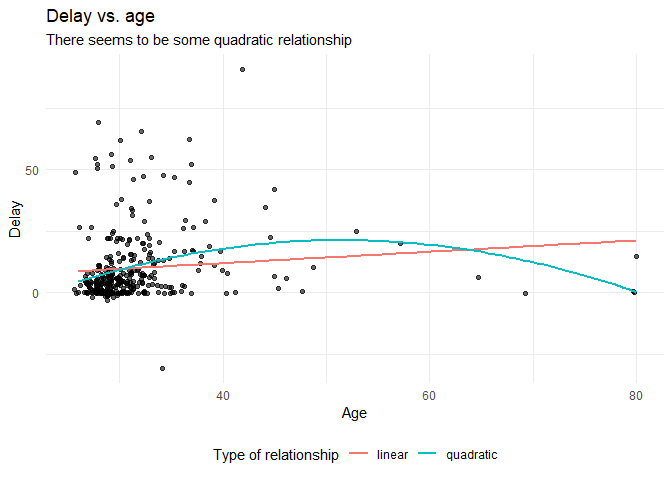

## Introduction
This tutorial provides the reader with a basic tutorial how to perform a regression analysis in [R](https://cran.r-project.org/). Throughout this tutorial, the reader will be guided through importing datafiles, exploring summary statistics and regression analyses. Here, we will exclusively focus on [frequentist statistics](https://www.rensvandeschoot.com/a-gentle-introduction-to-bayesian-analysis-applications-to-developmental-research/). 

  <p>&nbsp;</p>

## Preparation
This tutorial expects:

- Installation of R package `lavaan`. This tutorial was made using  Lavaan version 0.6.3 in R version 3.6.0
- Basic knowledge of hypothesis testing
- Basic knowledge of correlation and regression
- Basic knowledge of coding in R

## Example Data

The data we will be using for this exercise is based on a study about predicting PhD-delays ([Van de Schoot, Yerkes, Mouw and Sonneveld 2013](http://journals.plos.org/plosone/article?id=10.1371/journal.pone.0068839)).The data can be downloaded [here](https://www.rensvandeschoot.com/wp-content/uploads/2018/10/phd-delays.csv). Among many other questions, the researchers asked the Ph.D. recipients how long it took them to finish their Ph.D. thesis (n=333). It appeared that Ph.D. recipients took an average of 59.8 months (five years and four months) to complete their Ph.D. trajectory. The variable B3_difference_extra measures the difference between planned and actual project time in months (mean=9.97, minimum=-31, maximum=91, sd=14.43). For more information on the sample, instruments, methodology and research context we refer the interested reader to the paper.

For the current exercise we are interested in the question whether age (M = 31.7, SD = 6.86) of the Ph.D. recipients is related to a delay in their project.

The relation between completion time and age is expected to be non-linear. This might be due to that at a certain point in your life (i.e., mid thirties), family life takes up more of your time than when you are in your twenties or when you are older.

So, in our model the $gap$ (*B3_difference_extra*) is the dependent variable and $age$ (*E22_Age*) and $age^2$(*E22_Age_Squared *) are the predictors. The data can be found in the file <span style="color:red"> ` phd-delays.csv` </span>.

  <p>&nbsp;</p>

##### _**Question:** Write down the null and alternative hypotheses that represent this question. Which hypothesis do you deem more likely?_

<pre><code>[expand title=\"Answer\" trigclass=\\"noarrow my_button\\" targclass="my_content" tag= &quot; button &quot;]</code></pre>

$H_0:$ _$Age^2$ is not related to a delay in the PhD projects._

$H_1:$ _$Age^2$ is related to a delay in the PhD projects._ 

[/expand]

  <p>&nbsp;</p>


## Preparation - Importing and Exploring Data

Install the following packages in R:


```r
library(psych) #to get some extended summary statistics
library(tidyverse) # needed for data manipulation and plotting
```


You can find the data in the file <span style="color:red"> ` phd-delays.csv` </span>, which contains all variables that you need for this analysis. Although it is a .csv-file, you can directly load it into R using the following syntax:

```r
#read in data
dataPHD <- read.csv2(file="phd-delays.csv")
colnames(dataPHD) <- c("diff", "child", "sex","age","age2")
```


Alternatively, you can directly download them from GitHub into your R work space using the following command:

```r
dataPHD <- read.csv2(file="https://raw.githubusercontent.com/LaurentSmeets/Tutorials/master/Blavaan/phd-delays.csv")
colnames(dataPHD) <- c("diff", "child", "sex","age","age2")
```

GitHub is a platform that allows researchers and developers to share code, software and research and to collaborate on projects (see https://github.com/)

Once you loaded in your data, it is advisable to check whether your data import worked well. Therefore, first have a look at the summary statistics of your data. you can do this by using the  `describe()` function.

  <p>&nbsp;</p>
  
##### _**Question:** Have all your data been loaded in correctly? That is, do all data points substantively make sense? If you are unsure, go back to the .csv-file to inspect the raw data._

[expand title= \"Answer\" trigclass= \"noarrow my_button\" targclass=\"my_content\" tag=\"div\""]


```r
describe(dataPHD)
```

```
##       vars   n    mean     sd median trimmed    mad min  max range  skew
## diff     1 333    9.97  14.43      5    6.91   7.41 -31   91   122  2.21
## child    2 333    0.18   0.38      0    0.10   0.00   0    1     1  1.66
## sex      3 333    0.52   0.50      1    0.52   0.00   0    1     1 -0.08
## age      4 333   31.68   6.86     30   30.39   2.97  26   80    54  4.45
## age2     5 333 1050.22 656.39    900  928.29 171.98 676 6400  5724  6.03
##       kurtosis    se
## diff      5.92  0.79
## child     0.75  0.02
## sex      -2.00  0.03
## age      24.99  0.38
## age2     42.21 35.97
```

_The descriptive statistics make sense:_

_diff: Mean (9.97), SE (0.791)_

_$Age$: Mean (31.68), SE (0.38)_

_$Age^2$: Mean (1050.22), SE (35.97)_

[/expand]

  <p>&nbsp;</p>

## plot

Before we continue with analyzing the data we can also plot the expected relationship.


```r
dataPHD %>%
  ggplot(aes(x = age,
             y = diff)) +
  geom_point(position = "jitter",
             alpha    = .6)+ #to add some random noise for plotting purposes
  theme_minimal()+
  geom_smooth(method = "lm",  # to add  the linear relationship
              aes(color = "linear"),
              se = FALSE) +
  geom_smooth(method = "lm",
              formula = y ~ x + I(x^2),# to add  the quadratic relationship
              aes(color = "quadratic"),
              se = FALSE) +
  labs(title    = "Delay vs. age",
       subtitle = "There seems to be some quadratic relationship",
       x        = "Age",
       y        = "Delay",
       color    = "Type of relationship" ) +
  theme(legend.position = "bottom")
```

<!-- -->


## Regression Analysis
Now, let's run a multiple regression model predicting the difference between Ph.D. students' planned and actual project time by their age (note that we ignore assumption checking, if you want a quick introduction to the assumptions underlying a regression, please have look at https://statistics.laerd.com/spss-tutorials/linear-regression-using-spss-statistics.php).

To run a multiple regression with lavaan, you first specify the model, then fit
the model and finally acquire the summary. The model is specified as follows:

To run a multiple regression in R you can use the built in `lm()` function to run the regression and the  `summary()` function to have a look at the results. The `lm()` function takes as input:

1.  A depedent variable we want to predict.
2.  a "~", that we use to indicate that we now give the other variables of interest.
(comparable to the '=' of the regression equation).
3.  the different indepedent variables separated by the summation symbol '+'.
4. Finally we specify which dataset we want to use after the `data =` command.

For more information on the `lm()` function see the [LM manual](http://stat.ethz.ch/R-manual/R-devel/library/stats/html/lm.html) 

  <p>&nbsp;</p>

Now, preform a multiple linear regression and answer the following questions:

##### _**Question:** Using a significance criterion of 0.05, is there a significant effect of $age$ and $age^2$?_

[expand title=\"Answer\" trigclass=\"noarrow my_button\" targclass=\"my_content\" tag=\"button\"]


```r
regression <- lm(diff ~ age + age2, data = dataPHD)
```


```r
summary(regression)
```

```
## 
## Call:
## lm(formula = diff ~ age + age2, data = dataPHD)
## 
## Residuals:
##     Min      1Q  Median      3Q     Max 
## -44.412  -7.475  -4.073   1.794  72.027 
## 
## Coefficients:
##               Estimate Std. Error t value Pr(>|t|)    
## (Intercept) -47.087894  12.340701  -3.816 0.000162 ***
## age           2.657189   0.586131   4.533 8.13e-06 ***
## age2         -0.025817   0.006122  -4.217 3.20e-05 ***
## ---
## Signif. codes:  0 '***' 0.001 '**' 0.01 '*' 0.05 '.' 0.1 ' ' 1
## 
## Residual standard error: 14.01 on 330 degrees of freedom
## Multiple R-squared:  0.06258,	Adjusted R-squared:  0.0569 
## F-statistic: 11.02 on 2 and 330 DF,  p-value: 2.338e-05
```

  <p>&nbsp;</p>


_There is a significant effect of $age$ and $age^2$, with b=2.657, p &lt;.001 for $age$, and b=-0.026, p&lt;.001 for $age^2$._


[/expand]


_There is a significant effect of $age$ and $age^2$, with b=2.657, p &lt;.001 for $age$, and b=-0.026, p&lt;.001 for $age^2$._


[/expand]

  <p>&nbsp;</p> 


Surveys in academia have shown that a large number of researchers interpret the p-value wrong and misinterpretations are way more widespread than thought. Have a look at the article by [Greenland et al. (2016)](https://link.springer.com/article/10.1007/s10654-016-0149-3) that provides a guide to clear and concise interpretations of p.

  <p>&nbsp;</p> 
  
##### _**Question:** What can you conclude about the hypothesis being tested using the correct interpretation of the p-value?_

[expand title=\"Answer\" trigclass=\"noarrow my_button\" targclass=\"my_content\" tag=\"button\"]

_Assuming that the null hypothesis is true in the population, the probability of obtaining a test statistic that is as extreme or more extreme as the one we observe is &lt;0.1%. Because the effect of $age^2$ is below our pre-determined alpha level, we reject the null hypothesis._

[/expand]

  <p>&nbsp;</p>

Recently, a group of 72 notable statisticians proposed to shift the significance threshold to 0.005 ([Benjamin et al. 2017](https://osf.io/preprints/psyarxiv/mky9j), but see also a critique by[Trafimow, ., Van de Schoot, et al., 2018](https://www.rensvandeschoot.com/manipulating-alpha-level-cannot-cure-significance-testing/)). They argue that a p-value just below 0.05 does not provide sufficient evidence for statistical inference.


  <p>&nbsp;</p>

##### _**Question:** How does your conclusion change if you follow this advice?_

[expand title=\"Answer\" trigclass=\"noarrow my_button\" targclass=\"my_content\" tag=\"button\"]

_Because the p-values for both regression coefficients were really small &lt;.001, the conclusion doesn&#39;t change in this case._


[/expand]

  <p>&nbsp;</p>


Of course, we should never base our decisions on single criterions only. Luckily, there are several additional measures that we can take into account. A very popular measure is the confidence interval. To get the confidence intervals for the model parameter use the `confint()` function.


  <p>&nbsp;</p>


##### _**Question:** What can you conclude about the hypothesis being tested using the correct interpretation of the confidence interval?_


[expand title=Answer]


```r
confint(regression, level = 0.95)
```

```
##                    2.5 %       97.5 %
## (Intercept) -71.36425763 -22.81153094
## age           1.50416457   3.81021414
## age2         -0.03786079  -0.01377316
```

_$Age$: 95% CI [1.504, 3.810]_

_$Age^2$: 95% CI [-0.038, -0.014]_

_In both cases the 95% CI&#39;s don&#39;t contain 0, which means, the null hypotheses should be rejected. A 95% CI means, that, if infinitely samples were taken from the population, then 95% of the samples contain the true population value. But we do not know whether our current sample is part of this collection, so we only have an aggregated assurance that in the long run if our analysis would be repeated our sample CI contains the true population parameter._

[/expand]


Additionally, to make statements about the actual relevance of your results, focusing on effect size measures is inevitable.

##### _**Question:** What can you say about the relevance of your results? Focus on the explained variance and the standardized regression coefficients._

[expand title=Answer]

_R$^2$= 0.063 in the regression model. This means that 6.3% of the variance in the PhD delays, can be explained by $age$ and $age^2$._ 

We can also run the analysis again, but now with standardized coefficients. There are two easy ways to do this.

1. By standardizing (scaling) the variables in the in the regression formula using the `scale()` function.


```r
regressionscaled1 <- lm(scale(diff) ~ scale(age) + scale(age2), data = dataPHD)
summary(regressionscaled1)
```

```
## 
## Call:
## lm(formula = scale(diff) ~ scale(age) + scale(age2), data = dataPHD)
## 
## Residuals:
##     Min      1Q  Median      3Q     Max 
## -3.0775 -0.5180 -0.2822  0.1243  4.9911 
## 
## Coefficients:
##               Estimate Std. Error t value Pr(>|t|)    
## (Intercept)  1.034e-15  5.322e-02   0.000        1    
## scale(age)   1.262e+00  2.785e-01   4.533 8.13e-06 ***
## scale(age2) -1.174e+00  2.785e-01  -4.217 3.20e-05 ***
## ---
## Signif. codes:  0 '***' 0.001 '**' 0.01 '*' 0.05 '.' 0.1 ' ' 1
## 
## Residual standard error: 0.9711 on 330 degrees of freedom
## Multiple R-squared:  0.06258,	Adjusted R-squared:  0.0569 
## F-statistic: 11.02 on 2 and 330 DF,  p-value: 2.338e-05
```


2. Using the `lm.beta()` function from the QuantPsyc package

```r
library("QuantPsyc")
regressionscaled2 <- lm.beta(regression)
regressionscaled2
```

```
##       age      age2 
##  1.262435 -1.174266
```

_The standardized coefficients, age (1.262) and age$^2$ (-1.174), show that the effects of both regression coefficients are comparable, but the effect of age is somewhat higher._

[/expand]

  <p>&nbsp;</p>


Only a combination of different measures assessing different aspects of your results can provide a comprehensive answer to your research question.

  <p>&nbsp;</p>


##### _**Question:** Drawing on all the measures we discussed above, formulate an answer to your research question._

[expand title=\"Answer\" trigclass=\"noarrow my_button\" targclass=\"my_content\" tag=\"button\"]

_The variables $age$ and $age^2$ are significantly related to PhD delays. However, the total explained variance by those two predictors is only 6.3%. Therefore, a large part of the variance is still unexplained._

[/expand]
 <p>&nbsp;</p>
 <p>&nbsp;</p>


--- 
### **References**

_Benjamin, D. J., Berger, J., Johannesson, M., Nosek, B. A., Wagenmakers, E.,... Johnson, V. (2017, July 22)._ [Redefine statistical significance](https://psyarxiv.com/mky9j)_. Retrieved from psyarxiv.com/mky9j_

_Greenland, S., Senn, S. J., Rothman, K. J., Carlin, J. B., Poole, C., Goodman, S. N. Altman, D. G. (2016)._ [Statistical tests, P values, confidence intervals, and power: a guide to misinterpretations](https://link.springer.com/article/10.1007/s10654-016-0149-3)_._ _European Journal of Epidemiology 31 (4_). [_https://doi.org/10.1007/s10654-016-0149-3_](https://doi.org/10.1007/s10654-016-0149-3) _   _

_ Rosseel, Y. (2012)._ [lavaan: An R Package for Structural Equation Modeling](https://www.jstatsoft.org/article/view/v048i02). _Journal of Statistical Software, 48(2), 1-36. _

_van de Schoot R, Yerkes MA, Mouw JM, Sonneveld H (2013)_ [What Took Them So Long? Explaining PhD Delays among Doctoral Candidates](http://journals.plos.org/plosone/article?id=10.1371/journal.pone.0068839)_._ _PLoS ONE 8(7): e68839._ [https://doi.org/10.1371/journal.pone.0068839](https://doi.org/10.1371/journal.pone.0068839)

Trafimow D, Amrhein V, Areshenkoff CN, Barrera-Causil C, Beh EJ, Bilgi? Y, Bono R, Bradley MT, Briggs WM, Cepeda-Freyre HA, Chaigneau SE, Ciocca DR, Carlos Correa J, Cousineau D, de Boer MR, Dhar SS, Dolgov I, G?mez-Benito J, Grendar M, Grice J, Guerrero-Gimenez ME, Guti?rrez A, Huedo-Medina TB, Jaffe K, Janyan A, Karimnezhad A, Korner-Nievergelt F, Kosugi K, Lachmair M, Ledesma R, Limongi R, Liuzza MT, Lombardo R, Marks M, Meinlschmidt G, Nalborczyk L, Nguyen HT, Ospina R, Perezgonzalez JD, Pfister R, Rahona JJ, Rodr?guez-Medina DA, Rom?o X, Ruiz-Fern?ndez S, Suarez I, Tegethoff M, Tejo M, ** van de Schoot R** , Vankov I, Velasco-Forero S, Wang T, Yamada Y, Zoppino FC, Marmolejo-Ramos F. (2017)  [Manipulating the alpha level cannot cure significance testing - comments on &quot;Redefine statistical significance&quot;](https://www.rensvandeschoot.com/manipulating-alpha-level-cannot-cure-significance-testing/)_ _PeerJ reprints 5:e3411v1   [https://doi.org/10.7287/peerj.preprints.3411v1](https://doi.org/10.7287/peerj.preprints.3411v1)


