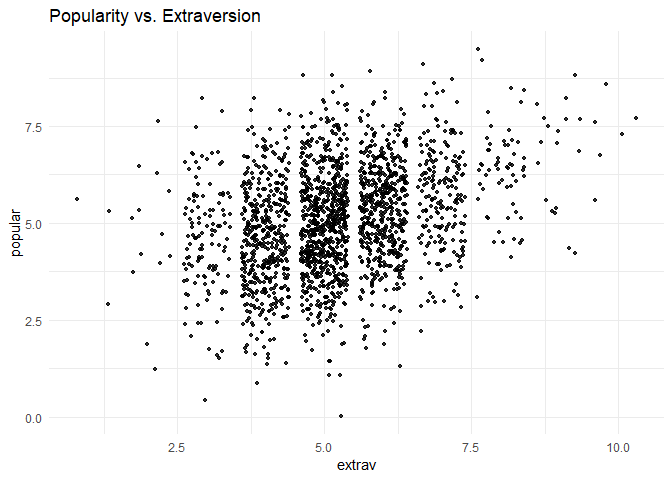
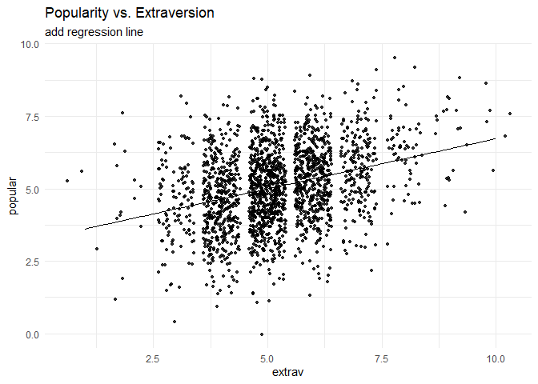
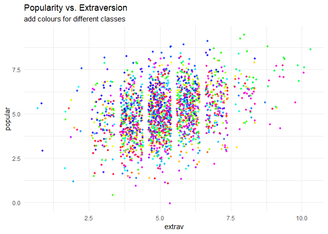
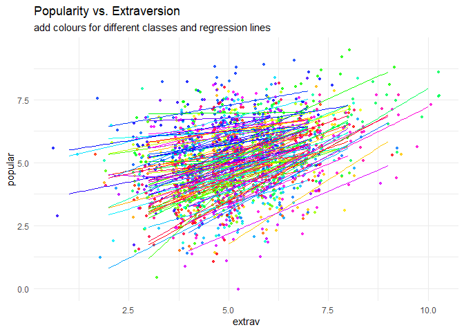
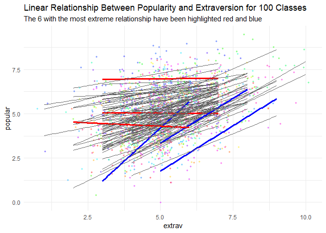
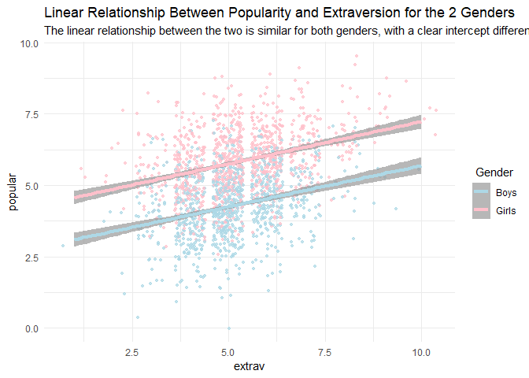
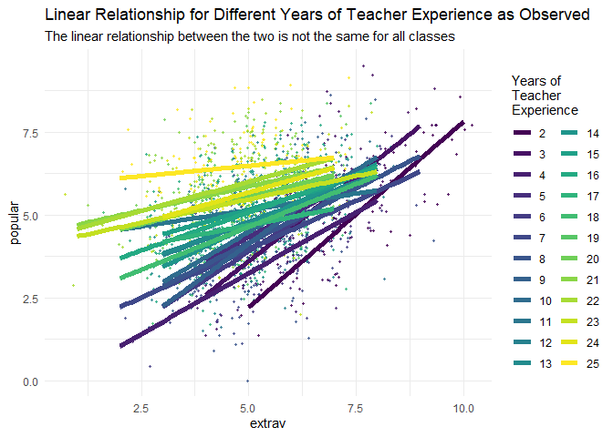
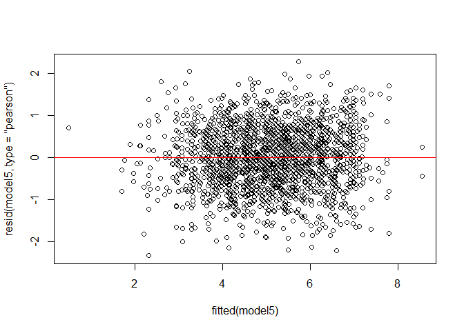

## Introduction
This tutorial gives a basic introduction to a multilevel regression and shows how you can replicate the popularity data multilevel models from the book [Multilevel analysis: Techniques and applications](https://www.rensvandeschoot.com/multilevel-book/), Chapter 2. In this tutorial, the software packages [LME4](https://cran.r-project.org/web/packages/lme4/index.html) and [lmerTest](https://cran.r-project.org/web/packages/lmerTest/index.html) for R (Windows) were used. Results should be very similar to results obtained with other software packages. However, due to convergence and rounding issues, you might notice minor differences. 
&nbsp;

## Preparation
This tutorial expects:

*  Basic knowledge of multilevel analyses (the first two chapters of the book are sufficient).
* Basic knowledge of coding in R.


&nbsp;


## Step 1: Setting up Packages

If you have not yet installed all below-mentioned packages, you can install them by the command `install.packages("NAMEOFPACKAGE")`.


```r
library(lme4) # for the analysis
library(haven) # to load the SPSS .sav file
library(tidyverse) # needed for data manipulation.
library(RColorBrewer) # needed for some extra colours in one of the graphs
library(lmerTest)# to get p-value estimations that are not part of the standard lme4 packages
```


The popularity dataset contains characteristics of pupils in different classes. The main goal of this tutorial is to find models and test hypotheses about the relation between these characteristics and the popularity of pupils (according to their classmates).
To download the popularity data go to https://multilevel-analysis.sites.uu.nl/datasets/ and follow the links to https://github.com/MultiLevelAnalysis/Datasets-third-edition-Multilevel-book/blob/master/chapter%202/popularity/SPSS/popular2.sav. We will use the .sav file which can be found in the SPSS folder. After downloading the data to your working directory you can open it with the read_sav() command.

Alternatively, you can directly download them from GitHub into your R workspace using the following command:

```{.r .fold-show}
popular2data <- read_sav(file ="https://github.com/MultiLevelAnalysis/Datasets-third-edition-Multilevel-book/blob/master/chapter%202/popularity/SPSS/popular2.sav?raw=true")
```
GitHub is a platform that allows researchers and developers to share code, software and research and to collaborate on projects (see https://github.com/)

### Data cleaning
There are some variables in the dataset that we do not use, so we can select the variables we will use and have a look at the first few observations.


```r
popular2data <- select(popular2data, pupil, class, extrav, sex, texp, popular) # we select just the variables we will use
head(popular2data) # we have a look at the first 6 observations
```

```
## # A tibble: 6 x 6
##   pupil class extrav       sex  texp popular
##   <dbl> <dbl>  <dbl> <dbl+lbl> <dbl>   <dbl>
## 1     1     1      5  1 [girl]    24     6.3
## 2     2     1      7  0 [boy]     24     4.9
## 3     3     1      4  1 [girl]    24     5.3
## 4     4     1      3  1 [girl]    24     4.7
## 5     5     1      5  1 [girl]    24     6  
## 6     6     1      4  0 [boy]     24     4.7
```


## Step 3: Plotting the Data

Before we start the analysis, we can plot the relationship between extraversion and popularity, without taking into consideration the multilevel structure of the data.


```r
ggplot(data  = popular2data,
       aes(x = extrav,
           y = popular))+
  geom_point(size = 1.2,
             alpha = .8,
             position = "jitter")+# to add some random noise for plotting purposes
  theme_minimal()+
  labs(title = "Popularity vs. Extraversion")
```

<!-- -->

Now we can add a regression line to this plot.


```r
ggplot(data  = popular2data,
       aes(x = extrav,
           y = popular))+
  geom_point(size     = 1.2,
             alpha    = .8,
             position = "jitter")+ #to add some random noise for plotting purposes
  geom_smooth(method = lm,
              se     = FALSE, 
              col    = "black",
              size   = .5, 
              alpha  = .8)+ # to add regression line
  theme_minimal()+
  labs(title    = "Popularity vs. Extraversion",
       subtitle = "add regression line")
```

<!-- -->

So far we have ignored the nested multilevel structure of the data. We can show this multilevel structure by colour coding the different classes.


```r
ggplot(data    = popular2data,
       aes(x   = extrav,
           y   = popular,
           col = class))+ #to add the colours for different classes
  geom_point(size     = 1.2,
             alpha    = .8,
             position = "jitter")+ #to add some random noise for plotting purposes
  theme_minimal()+
  theme(legend.position = "none")+
  scale_color_gradientn(colours = rainbow(100))+
  labs(title    = "Popularity vs. Extraversion",
       subtitle = "add colours for different classes")
```

<!-- -->

Now we can draw different regression lines for the 100 different classes in the data


```r
ggplot(data      = popular2data,
       aes(x     = extrav,
           y     = popular,
           col   = class,
           group = class))+ #to add the colours for different classes
  geom_point(size     = 1.2,
             alpha    = .8,
             position = "jitter")+ #to add some random noise for plotting purposes
  theme_minimal()+
  theme(legend.position = "none")+
  scale_color_gradientn(colours = rainbow(100))+
  geom_smooth(method = lm,
              se     = FALSE,
              size   = .5, 
              alpha  = .8)+ # to add regression line
  labs(title    = "Popularity vs. Extraversion",
       subtitle = "add colours for different classes and regression lines")
```

<!-- -->

We clearly see that the relationship between extraversion and popularity is not the same in all classes, but on average there is a clear positive relationship. In this tutorial, we will show the estimation of these different slopes (and how the explain these differences). Again, for more information please refer to the book [Multilevel analysis: Techniques and applications](https://www.rensvandeschoot.com/multilevel-book/).  

We can also colour code the most extreme regression lines.


```r
# To colour code the extremes, we need to write a small function that calculates the regression lines and adds a collumn indicating which clusters have the most extreme.
f1 <- function(data, x, y, grouping, n.highest = 3, n.lowest = 3){
  groupinglevel <- data[,grouping]
  res           <- data.frame(coef = rep(NA, length(unique(groupinglevel))), group = unique(groupinglevel))
  names(res)    <- c("coef", grouping)
  for(i in 1:length(unique(groupinglevel))){
    data2    <- as.data.frame(data[data[,grouping] == i,])
    res[i,1] <- as.numeric(lm(data2[, y] ~ data2[, x])$coefficients[2])
  }
  top    <- res %>% top_n(n.highest, coef)
  bottom <- res %>% top_n(-n.lowest, coef)
  res    <- res %>% mutate(high_and_low = ifelse(coef %in% top$coef, "top",  ifelse(coef %in% bottom$coef, "bottom", "none")))
  data3  <- left_join(data, res)
  return(data3)
}
```
 
Now we can use this function on the popularity data.

```r
f1(data = as.data.frame(popular2data), 
   x    = "extrav",
   y    = "popular",
   grouping = "class",
   n.highest = 3, 
   n.lowest = 3) %>%
  ggplot()+
  geom_point(aes(x     = extrav,
                 y     = popular, 
                 fill  = class, 
                 group = class),
             size     =  1, 
             alpha    = .5, 
             position = "jitter", 
             shape    = 21, 
             col      = "white")+
  geom_smooth(aes(x     = extrav,
                  y     = popular,
                  col   = high_and_low,
                  group = class,
                  size  = as.factor(high_and_low),
                  alpha = as.factor(high_and_low)),
              method = lm,
              se     = FALSE)+
  theme_minimal()+
  theme(legend.position = "none")+
  scale_fill_gradientn(colours = rainbow(100))+
  scale_color_manual(values=c("top"      = "blue",
                              "bottom"   = "red",
                              "none"     = "grey40"))+
  scale_size_manual(values=c("top"       = 1.2,
                              "bottom"   = 1.2,
                              "none"     = .5))+
  scale_alpha_manual(values=c("top"      = 1,
                             "bottom"    = 1,
                             "none"      =.3))+
  labs(title="Linear Relationship Between Popularity and Extraversion for 100 Classes",
       subtitle="The 6 with the most extreme relationship have been highlighted red and blue")
```

<!-- -->


## Step 4: Analysing the Data


## Intercept only model
The first model that we replicate is the intercept only model.

```r
interceptonlymodel <- lmer(formula = popular ~ 1 + (1|class),
                           data    = popular2data) #to run the model
```

If we look at the different inputs for the LMER function we:

1.  have "popular", which indicates the dependent variable we want to predict.
2.  a "~", that we use to indicate that we now give the other variables of interest.
(comparable to the '=' of the regression equation).
3.  a "1" in the formula which indicates the intercept.
4.  since this is an intercept only model, we do not have any other independent variables here. 
5.  between brackets we have the random effects/slopes. Again the value 1 is to indicate the intercept and the variables right of the vertical "|" bar are used to indicate grouping variables. In this case the class ID. So the dependent variable 'popular' is predicted by an intercept and a random error term for the intercept. 
6.  Finally, we specify which dataset we want to use after the `data =`  command

For more information on the LMER function see the [Lme4 manual](https://cran.r-project.org/web/packages/lme4/lme4.pdf) 


```r
summary(interceptonlymodel) #to get paramater estimates.
```

```
## Linear mixed model fit by REML. t-tests use Satterthwaite's method [
## lmerModLmerTest]
## Formula: popular ~ 1 + (1 | class)
##    Data: popular2data
## 
## REML criterion at convergence: 6330.5
## 
## Scaled residuals: 
##     Min      1Q  Median      3Q     Max 
## -3.5655 -0.6975  0.0020  0.6758  3.3175 
## 
## Random effects:
##  Groups   Name        Variance Std.Dev.
##  class    (Intercept) 0.7021   0.8379  
##  Residual             1.2218   1.1053  
## Number of obs: 2000, groups:  class, 100
## 
## Fixed effects:
##             Estimate Std. Error       df t value Pr(>|t|)    
## (Intercept)  5.07786    0.08739 98.90973    58.1   <2e-16 ***
## ---
## Signif. codes:  0 '***' 0.001 '**' 0.01 '*' 0.05 '.' 0.1 ' ' 1
```

If we look at the summary output we see under the Random Effects that the residual variance on the class level  0.7021 and residual variance on the first level (pupil level) is 1.2218. This means that the intraclass correlation (ICC) is 0.7021/(1.2218+0.7021)=.36.

Under Fixed Effects the estimate of the intercept is reported, which is 5.078.

We can also use the sjstats package to calculate the ICC from the lmer output. You, of course, will have to load this package first, using `library(sjstats)`


```r
library(sjstats)
```


```r
icc(interceptonlymodel)
```

```
## # Intraclass Correlation Coefficient
## 
##      Adjusted ICC: 0.365
##   Conditional ICC: 0.365
```

## First Level Predictors

Now we can now first add first (student) level predictors. The first level predictors are sex and extraversion. For now we just add them as fixed effects and not yet as random slopes. Before doing so we can plot the difference in effect for the two genders. We see there likely is an average difference between genders, but no difference in slopes (regression coefficients).

```r
ggplot(data = popular2data, 
       aes(x   = extrav,
           y   = popular, 
           col = as.factor(sex)))+
  geom_point(size     = 1, 
             alpha    = .7, 
             position = "jitter")+
  geom_smooth(method   = lm,
              se       = T, 
              size     = 1.5, 
              linetype = 1, 
              alpha    = .7)+
  theme_minimal()+
  labs(title    = "Linear Relationship Between Popularity and Extraversion for the 2 Genders", 
       subtitle = "The linear relationship between the two is similar for both genders, with a clear intercept difference")+
  scale_color_manual(name   =" Gender",
                     labels = c("Boys", "Girls"),
                     values = c("lightblue", "pink"))
```

<!-- -->


```r
model1 <- lmer(formula = popular ~ 1 + sex + extrav + (1|class), 
               data    = popular2data)
summary(model1)
```

```
## Linear mixed model fit by REML. t-tests use Satterthwaite's method [
## lmerModLmerTest]
## Formula: popular ~ 1 + sex + extrav + (1 | class)
##    Data: popular2data
## 
## REML criterion at convergence: 4948.3
## 
## Scaled residuals: 
##     Min      1Q  Median      3Q     Max 
## -3.2091 -0.6575 -0.0044  0.6732  2.9755 
## 
## Random effects:
##  Groups   Name        Variance Std.Dev.
##  class    (Intercept) 0.6272   0.7919  
##  Residual             0.5921   0.7695  
## Number of obs: 2000, groups:  class, 100
## 
## Fixed effects:
##              Estimate Std. Error        df t value Pr(>|t|)    
## (Intercept) 2.141e+00  1.173e-01 3.908e+02   18.25   <2e-16 ***
## sex         1.253e+00  3.743e-02 1.927e+03   33.48   <2e-16 ***
## extrav      4.416e-01  1.616e-02 1.957e+03   27.33   <2e-16 ***
## ---
## Signif. codes:  0 '***' 0.001 '**' 0.01 '*' 0.05 '.' 0.1 ' ' 1
## 
## Correlation of Fixed Effects:
##        (Intr) sex   
## sex    -0.100       
## extrav -0.705 -0.085
```

As default, the lmer function does only give test statistics and estimates, but no p-values. However, because we use the `lmerTest package` we do get P-values. The intercept is now 2.14, the regression coefficient for sex is 1.25, and the regression coefficient for extraversion 0.44. In the last column of the Fixed effects table of the output we see the P-values, which indicate all regression coefficients are significantly different from 0. The results of this output are not given in the book.

## First and Second Level Predictors

We now also (in addition to the level 1 variables that were both significant) add a predictor variable on the second level (teacher experience).


```r
model2 <- lmer(popular ~ 1 + sex + extrav + texp + (1 | class), data=popular2data)
summary(model2)
```

```
## Linear mixed model fit by REML. t-tests use Satterthwaite's method [
## lmerModLmerTest]
## Formula: popular ~ 1 + sex + extrav + texp + (1 | class)
##    Data: popular2data
## 
## REML criterion at convergence: 4885
## 
## Scaled residuals: 
##     Min      1Q  Median      3Q     Max 
## -3.1745 -0.6491 -0.0075  0.6705  3.0078 
## 
## Random effects:
##  Groups   Name        Variance Std.Dev.
##  class    (Intercept) 0.2954   0.5435  
##  Residual             0.5920   0.7694  
## Number of obs: 2000, groups:  class, 100
## 
## Fixed effects:
##              Estimate Std. Error        df t value Pr(>|t|)    
## (Intercept) 8.098e-01  1.700e-01 2.264e+02   4.764  3.4e-06 ***
## sex         1.254e+00  3.729e-02 1.948e+03  33.623  < 2e-16 ***
## extrav      4.544e-01  1.616e-02 1.955e+03  28.112  < 2e-16 ***
## texp        8.841e-02  8.764e-03 1.016e+02  10.087  < 2e-16 ***
## ---
## Signif. codes:  0 '***' 0.001 '**' 0.01 '*' 0.05 '.' 0.1 ' ' 1
## 
## Correlation of Fixed Effects:
##        (Intr) sex    extrav
## sex    -0.040              
## extrav -0.589 -0.090       
## texp   -0.802 -0.036  0.139
```

The results show that both the level 1 and level 2 variables are significant. However, we have not added random slopes yet for any variables (as is done in table 2.1 in the book).

We can now also calculate the explained variance at level 1 and at level 2 compared to the base model.


*  For level 1 this is (1.2218 - 0.592)/1.2218 = 0.52 
*  For level 2 this is (0.7021 - 0.2954)/0.7021 = 0.58


## First and Second Level Predictors with Random Slopes (1)
Now we also want to include random slopes. In the third column of Table 2.1, both predictor variables from level 1 (sex and extraversion) have random slopes. To accomplish this in LMER just add the variables for which we want to add random slopes to the random part of the input. This means that `(1|class) `becomes `(1+sex+extrav |class)`.


```r
model3 <- lmer(formula = popular ~ 1 + sex + extrav + texp + (1 + sex + extrav | class),
               data    = popular2data)
```

```
## Warning in checkConv(attr(opt, "derivs"), opt$par, ctrl =
## control$checkConv, : Model failed to converge with max|grad| = 0.026373
## (tol = 0.002, component 1)
```

```r
summary(model3)
```

```
## Linear mixed model fit by REML. t-tests use Satterthwaite's method [
## lmerModLmerTest]
## Formula: popular ~ 1 + sex + extrav + texp + (1 + sex + extrav | class)
##    Data: popular2data
## 
## REML criterion at convergence: 4833.3
## 
## Scaled residuals: 
##     Min      1Q  Median      3Q     Max 
## -3.1643 -0.6555 -0.0247  0.6711  2.9571 
## 
## Random effects:
##  Groups   Name        Variance Std.Dev. Corr       
##  class    (Intercept) 1.341820 1.15837             
##           sex         0.002395 0.04894  -0.39      
##           extrav      0.034738 0.18638  -0.88 -0.10
##  Residual             0.551448 0.74260             
## Number of obs: 2000, groups:  class, 100
## 
## Fixed effects:
##              Estimate Std. Error        df t value Pr(>|t|)    
## (Intercept) 7.585e-01  1.973e-01 1.811e+02   3.845 0.000167 ***
## sex         1.251e+00  3.694e-02 9.862e+02  33.860  < 2e-16 ***
## extrav      4.529e-01  2.464e-02 9.620e+01  18.375  < 2e-16 ***
## texp        8.952e-02  8.617e-03 1.014e+02  10.389  < 2e-16 ***
## ---
## Signif. codes:  0 '***' 0.001 '**' 0.01 '*' 0.05 '.' 0.1 ' ' 1
## 
## Correlation of Fixed Effects:
##        (Intr) sex    extrav
## sex    -0.062              
## extrav -0.718 -0.066       
## texp   -0.684 -0.039  0.089
## convergence code: 0
## Model failed to converge with max|grad| = 0.026373 (tol = 0.002, component 1)
```

We can see that all the fixed regression slopes are still significant. However, no significance test for the Random effects are given, but we do see that the error term (Variance) for the slope of the variable sex is estimated to be very small (0.0024). This likely means that there is no slope variation of the SEX variable between classes and therefore the random slope estimation can be dropped from the next analyses. Since there is no direct significance test for this Variance we can use the `ranova()` function of the `lmerTest` package, which will give us an ANOVA-like table for random effects. It checks whether the model becomes significantly worse if a certain random effect is dropped (formally known as likelihood ratio tests), if this is not the case, the random effect is not significant.


```r
ranova(model3)
```

```
## ANOVA-like table for random-effects: Single term deletions
## 
## Model:
## popular ~ sex + extrav + texp + (1 + sex + extrav | class)
##                                      npar  logLik    AIC    LRT Df
## <none>                                 11 -2416.6 4855.3          
## sex in (1 + sex + extrav | class)       8 -2417.4 4850.8  1.513  3
## extrav in (1 + sex + extrav | class)    8 -2441.9 4899.8 50.506  3
##                                      Pr(>Chisq)    
## <none>                                             
## sex in (1 + sex + extrav | class)        0.6792    
## extrav in (1 + sex + extrav | class)  6.232e-11 ***
## ---
## Signif. codes:  0 '***' 0.001 '**' 0.01 '*' 0.05 '.' 0.1 ' ' 1
```
We see that the random effect of sex is indeed not significant (P = 0.6792) and the random effect of extraversion is significant  (P<.0001).


## First and Second Level Predictors with Random Slopes (2)

We continue after omitting the random slope of sex.


```r
model4 <- lmer(formula = popular ~ 1 + sex + extrav + texp + (1 + extrav |class), 
               data    = popular2data)
summary(model4)
```

```
## Linear mixed model fit by REML. t-tests use Satterthwaite's method [
## lmerModLmerTest]
## Formula: popular ~ 1 + sex + extrav + texp + (1 + extrav | class)
##    Data: popular2data
## 
## REML criterion at convergence: 4834.8
## 
## Scaled residuals: 
##     Min      1Q  Median      3Q     Max 
## -3.1768 -0.6475 -0.0235  0.6648  2.9684 
## 
## Random effects:
##  Groups   Name        Variance Std.Dev. Corr 
##  class    (Intercept) 1.30296  1.1415        
##           extrav      0.03455  0.1859   -0.89
##  Residual             0.55209  0.7430        
## Number of obs: 2000, groups:  class, 100
## 
## Fixed effects:
##              Estimate Std. Error        df t value Pr(>|t|)    
## (Intercept) 7.362e-01  1.966e-01 1.821e+02   3.745 0.000242 ***
## sex         1.252e+00  3.657e-02 1.913e+03  34.240  < 2e-16 ***
## extrav      4.526e-01  2.461e-02 9.754e+01  18.389  < 2e-16 ***
## texp        9.098e-02  8.685e-03 1.017e+02  10.475  < 2e-16 ***
## ---
## Signif. codes:  0 '***' 0.001 '**' 0.01 '*' 0.05 '.' 0.1 ' ' 1
## 
## Correlation of Fixed Effects:
##        (Intr) sex    extrav
## sex    -0.031              
## extrav -0.717 -0.057       
## texp   -0.688 -0.039  0.086
```

We see that:

*  The intercept is 0.736
*  The fixed effect of sex is 1.252
*  The effect of teacher experience is 0.091
*  The mean effect of extraversion is 0.453
*  The random effect of the slope of extraversion is 0.035
*  First level residual variance is 0.552
*  The residual variance on the second level is 1.303

&nbsp;

## First and Second Level Predictors with Random Slopes and Crosslevel Interaction

As a final step, we can add a cross-level interaction between teacher experience and extraversion (since this had a significant random effect, that we might be able to explain). In other words, we want to investigate whether the differences in the relation between extraversion and popularity in the classes can be explained by the teacher experience of the teacher of that class. In this next step to reproduce Model M2 from Table 2.3, we add the cross-level interaction between Extraversion and Teacher experience. This means we have to add TEXP as a predictor for the coefficient of EXTRAV. The cross level interaction term between extraversion and teacher experience can be created by the ':' sign or by multiplying the terms.

If we put all of this in formula form we get: $Popularity_{ij}=\beta_{0j}+\beta_1*gender_{ij}+ \beta_{2j}*extraversion_{ij}+e_{ij}$. 

In which $\beta_{0j}=\gamma_{00}+\gamma_{01}*experience_j+u_{0j}$  and  $\beta_{2j}= \gamma_{20}+\gamma_{21}*experience_j+u_{2j}$

Combined we get:

$$Popularity_{ij}= \gamma_{00}+\gamma_{10}*sex_{ij}+\gamma_{20}*extraversion_{ij}+\gamma_{01}*experience_j+\gamma_{21}*extraversion_{ij}*experience_j+u_{2j}*extraversion_{ij}+u_{0j}+e_{ij}$$


```r
model5<-lmer(formula = popular ~ 1 + sex + extrav + texp+ extrav:texp + (1 + extrav | class), 
             data    = popular2data)
summary(model5)
```

```
## Linear mixed model fit by REML. t-tests use Satterthwaite's method [
## lmerModLmerTest]
## Formula: popular ~ 1 + sex + extrav + texp + extrav:texp + (1 + extrav |  
##     class)
##    Data: popular2data
## 
## REML criterion at convergence: 4780.5
## 
## Scaled residuals: 
##      Min       1Q   Median       3Q      Max 
## -3.12872 -0.63857 -0.01129  0.67916  3.05006 
## 
## Random effects:
##  Groups   Name        Variance Std.Dev. Corr 
##  class    (Intercept) 0.478639 0.69184       
##           extrav      0.005409 0.07355  -0.64
##  Residual             0.552769 0.74348       
## Number of obs: 2000, groups:  class, 100
## 
## Fixed effects:
##               Estimate Std. Error         df t value Pr(>|t|)    
## (Intercept) -1.210e+00  2.719e-01  1.093e+02  -4.449 2.09e-05 ***
## sex          1.241e+00  3.623e-02  1.941e+03  34.243  < 2e-16 ***
## extrav       8.036e-01  4.012e-02  7.207e+01  20.031  < 2e-16 ***
## texp         2.262e-01  1.681e-02  9.851e+01  13.458  < 2e-16 ***
## extrav:texp -2.473e-02  2.555e-03  7.199e+01  -9.679 1.15e-14 ***
## ---
## Signif. codes:  0 '***' 0.001 '**' 0.01 '*' 0.05 '.' 0.1 ' ' 1
## 
## Correlation of Fixed Effects:
##             (Intr) sex    extrav texp  
## sex          0.002                     
## extrav      -0.867 -0.065              
## texp        -0.916 -0.047  0.801       
## extrav:texp  0.773  0.033 -0.901 -0.859
```

The interaction term is denoted by `extrav:texp` under `Fixed effects` and is estimated at -0.025.

From these results we can now also calculate the explained slope variance of extraversion by using teacher experience as second level variable: (0.03455-0.005409)/0.03455 = .843 (These results are slightly different than in the book and than in HLM, that is because different estimation and rounding methods are used). So 84.3%  of the variance of the regression coefficients of the extraversion slopes can be explained by the experience of the teacher.


As explained in the book and shown in the results, both the intercept and the slope of the coefficient of extraversion on popularity is influenced by teacher experience. A male student (SEX = 0) with an extraversion score of 0 in a class with a teacher with 0 years of experience has an expected popularity of -1.2096 (these values are of course impossible, centring is a good strategy to prevent these impossible results). A similar (male) student will improve its popularity with 0.8036 points for every point more extraversion. When teacher experience increases, the intercept also increases with 0.226 for every year of experience. So the same male student with no extraversion in a class with a teacher with 15 years of experience has an expected popularity score of -1.2096 + (15 x .226) = 2.1804. The teacher experience also lessens the effect of extraversion on popularity. For a teacher with 15 years of experience the regression coefficient of extraversion on popularity is only 0.8036 - (15 x .0247) = 0.4331 (compared to 0.8036 in a class with a teacher with 0 years of experience).

In a plot we can also clearly see that years of teacher experience has influence on both the intercept and the regression coefficient of extraversion on popularity. 

```r
ggplot(data = popular2data,
       aes(x = extrav, 
           y = popular, 
           col = as.factor(texp)))+
  viridis::scale_color_viridis(discrete = TRUE)+
  geom_point(size     = .7,
             alpha    = .8, 
             position = "jitter")+
  geom_smooth(method = lm,
              se     = FALSE,
              size   = 2,
              alpha  = .8)+
  theme_minimal()+
  labs(title    = "Linear Relationship for Different Years of Teacher Experience as Observed", 
       subtitle = "The linear relationship between the two is not the same for all classes", 
       col      = "Years of\nTeacher\nExperience")
```

<!-- -->
&nbsp;

## Residual Checks
To end this tutorial we will check whether the residuals of the model are normally distributed (at both levels). In addition to residuals being normally distributed, a multilevel model assumes that variance of the residuals is equal across groups (classes) for the different random effects. Statistical tests of normality and equality of variance across groups do exist, but this tutorial is limited to visual inspections.

#### 1  
First, we can check for homoscedasticity by comparing residuals to the fitted items. In our example we see a nice fat circle and no cone-shaped figure.


```r
plot(fitted(model5), resid(model5, type = "pearson"))# this will create the plot
abline(0,0, col="red")
```

<!-- -->

We can also use a QQ-plot to check for normality of residuals. This plot does indicate residuals are normally distributed.


```r
qqnorm(resid(model5)) 
qqline(resid(model5), col = "red") # add a perfect fit line
```

<!-- -->

#### 2 
Now we can also check it for the two random effects (intercept and extrav) for the 100 classes. Again, there is no reason to suspect any violation was broken.
 

```r
qqnorm(ranef(model5)$class[,1] )
qqline(ranef(model5)$class[,1], col = "red")
```

<!-- -->

```r
qqnorm(ranef(model5)$class[,2])
qqline(ranef(model5)$class[,2], col = "red")
```

<!-- -->

