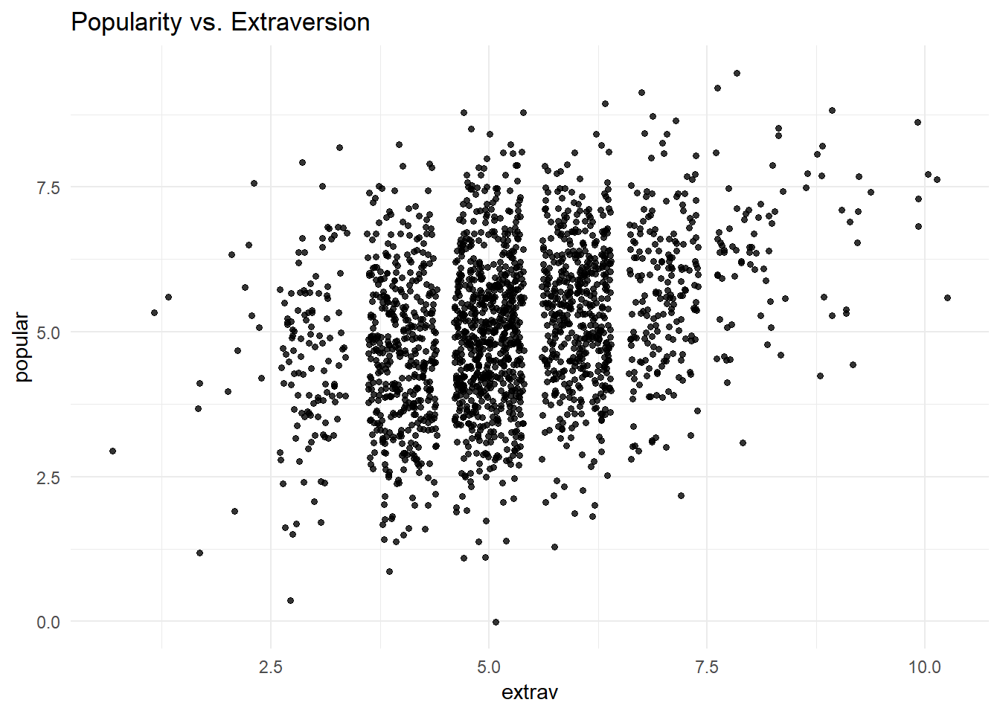
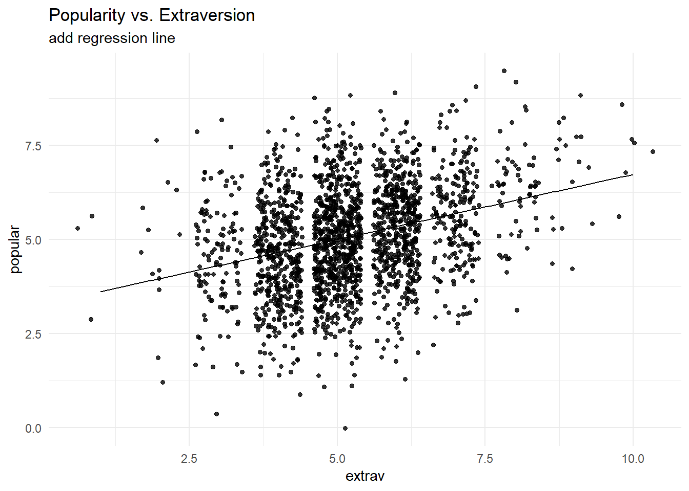
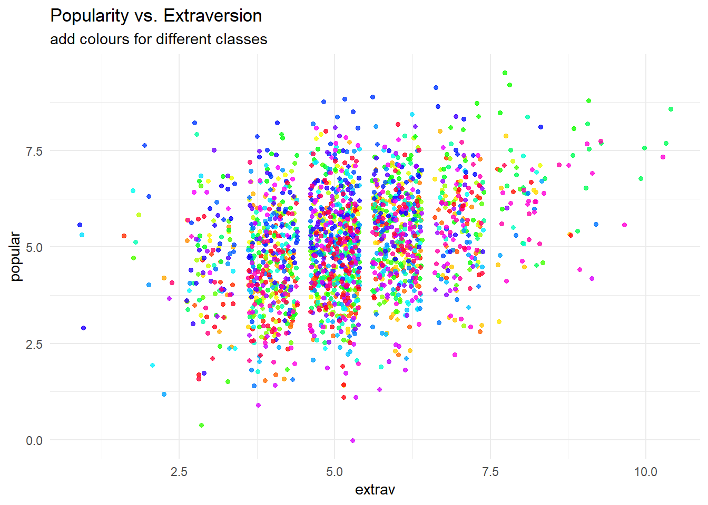

## Introduction
This tutorial gives a basic introduction to a multilevel regression and shows how you can replicate the popularity data multilevel models from the book [Multilevel analysis: Techniques and applications](https://www.rensvandeschoot.com/multilevel-book/), Chapter 2. In this tutorial, the software packages [LME4](https://cran.r-project.org/web/packages/lme4/index.html) and [lmerTest](https://cran.r-project.org/web/packages/lmerTest/index.html) for R (Windows) were used. Results should be very similar to results obtained with other software packages, however due to convergence and rounding issues, you might notice minor differences. 
&nbsp;

## Preparation
This tutorial expects:

*  Basic knowledge of multilevel analyses (first two chapters of the book are sufficient).
* Basic knowledge of coding in R.


&nbsp;


## Step 1: Setting up Packages

If you have not yet installed all below mentioned packages, you can install them by the command `install.packages("NAMEOFPACKAGE")`.


```r
library(lme4) # for the analysis
library(haven) # to load the SPSS .sav file
library(tidyverse) # needed for data manipulation.
library(RColorBrewer) # needed for some extra colours in one of the graphs
library(lmerTest)# to get p-value estimations that are not part of the standard lme4 packages
```


The popularity dataset contains characteristics of pupils in different classes. The main goal of this tutorial is to find models and test hypotheses about the relation between these characteristics and the popularity of pupils (according to their classmates).
To download the popularity data go to https://multilevel-analysis.sites.uu.nl/datasets/ and follow the links to https://github.com/MultiLevelAnalysis/Datasets-third-edition-Multilevel-book/blob/master/chapter%202/popularity/SPSS/popular2.sav. We will use the .sav file which can be found in the SPSS folder. After downloading the data to your working directory you can open it with the read_sav() command.

Alternatively, you can directly download them from GitHub into your R work space using the following command:

```r
popular2data <- read_sav(file ="https://github.com/MultiLevelAnalysis/Datasets-third-edition-Multilevel-book/blob/master/chapter%202/popularity/SPSS/popular2.sav?raw=true")
```
GitHub is a platform that allows researchers and developers to share code, software and research and to collaborate on projects (see https://github.com/)

### Data cleaning
There are some variables in the dataset that we do not use, so we can select the variables we will use and have a look at the first few observations.


```r
popular2data <- select(popular2data, pupil, class, extrav, sex, texp, popular) # we select just the variables we will use
head(popular2data) # we have a look at the first 6 observations
```

```
## # A tibble: 6 x 6
##   pupil class extrav       sex  texp popular
##   <dbl> <dbl>  <dbl> <dbl+lbl> <dbl>   <dbl>
## 1     1     1      5  1 [girl]    24     6.3
## 2     2     1      7  0 [boy]     24     4.9
## 3     3     1      4  1 [girl]    24     5.3
## 4     4     1      3  1 [girl]    24     4.7
## 5     5     1      5  1 [girl]    24     6  
## 6     6     1      4  0 [boy]     24     4.7
```


## Step 3: Analysing the Data

Before we start the analysis, we can plot the relationship between extraversion and popularity, without taking into consideration the multilevel structure of the data.


```r
ggplot(data  = popular2data,
       aes(x = extrav,
           y = popular))+
  geom_point(size = 1.2,
             alpha = .8,
             position = "jitter")+# to add some random noise for plotting purposes
  theme_minimal()+
  labs(title = "Popularity vs. Extraversion")
```

<!-- -->

Now we can add a regression line to this plot.


```r
ggplot(data  = popular2data,
       aes(x = extrav,
           y = popular))+
  geom_point(size     = 1.2,
             alpha    = .8,
             position = "jitter")+ #to add some random noise for plotting purposes
  geom_smooth(method = lm,
              se     = FALSE, 
              col    = "black",
              size   = .5, 
              alpha  = .8)+ # to add regression line
  theme_minimal()+
  labs(title    = "Popularity vs. Extraversion",
       subtitle = "add regression line")
```

<!-- -->

So far we have ignored the nested multilevel structure of the data. We can show this multilevel structure by colour coding the different classes.


```r
ggplot(data    = popular2data,
       aes(x   = extrav,
           y   = popular,
           col = class))+ #to add the colours for different classes
  geom_point(size     = 1.2,
             alpha    = .8,
             position = "jitter")+ #to add some random noise for plotting purposes
  theme_minimal()+
  theme(legend.position = "none")+
  scale_color_gradientn(colours = rainbow(100))+
  labs(title    = "Popularity vs. Extraversion",
       subtitle = "add colours for different classes")
```

<!-- -->

Now we can draw different regression lines for the 100 different classes in the data


```r
ggplot(data    = popular2data,
       aes(x   = extrav,
           y   = popular,
           col = class))+ #to add the colours for different classes
  geom_point(size     = 1.2,
             alpha    = .8,
             position = "jitter")+ #to add some random noise for plotting purposes
  theme_minimal()+
  theme(legend.position = "none")+
  scale_color_gradientn(colours = rainbow(100))+
  geom_smooth(method = lm,
              se     = FALSE, 
              col    = "black",
              size   = .5, 
              alpha  = .8)+ # to add regression line
  labs(title    = "Popularity vs. Extraversion",
       subtitle = "add colours for different classes and regression lines")
```

<!-- -->

We clearly see that the relationship between extraversion and popularity is not the same in all classes, but on average there is a clear positive relationship. In this tutorial we will show the estimation of these different slopes (and how the explain these differences). Again, for more information please refer the book [Multilevel analysis: Techniques and applications](https://www.rensvandeschoot.com/multilevel-book/).  

We can also colour code the most extreme regression lines.


```r
f1 <- function(data, x, y, grouping, n.highest = 3, n.lowest = 3){
  require(tidyverse)
  groupinglevel <- data[,grouping]
  res <- data.frame(coef=rep(NA,length(unique(groupinglevel))), group= unique(groupinglevel))
  names(res) <- c("coef", grouping)
  for(i in 1:length(unique(groupinglevel))){
    #print(i)}
    data2 <- as.data.frame(data[data[,grouping] == i,])
    res[i,1] <- as.numeric(lm(data2[, y]~data2[, x])$coefficients[2])
  }
  top <- res %>% top_n(n.highest, coef)
  bottom <- res %>% top_n(-n.lowest, coef)
  res <-res %>% mutate(high_and_low = ifelse(coef %in% top$coef, "top",  ifelse(coef %in% bottom$coef, "bottom", "none")))
  data3 <- left_join(data, res)
  return(data3)
  }

p5 <- f1(data = as.data.frame(popular2data), 
   x ="extrav",
   y = "popular",
   grouping = "class",
   n.highest = 3, 
   n.lowest = 3) %>%
  ggplot()+
  geom_point(aes(x=extrav, y=popular, fill = class, group=class),
             size=1, alpha=.5, position = "jitter", shape =21, col = "white")+
  geom_smooth(aes(x=extrav,
                  y=popular,
                  col = high_and_low,
                  group = class,
                  size = as.factor(high_and_low),
                  alpha = as.factor(high_and_low)),
              method=lm,se=FALSE)+
  theme_minimal()+
  theme(legend.position = "none")+
  scale_fill_gradientn(colours = rainbow(100))+
  scale_color_manual(values=c("top"      = "blue",
                              "bottom"      = "red",
                              "none"  = "grey40"))+
  scale_size_manual(values=c("top"      = 1.2,
                              "bottom"      = 1.2,
                              "none"  = .5))+
  scale_alpha_manual(values=c("top"      = 1,
                             "bottom"      = 1,
                             "none"  = .3))+
  labs(title="Linear Relationship Between Popularity and Extraversion for 100 Classes",
       subtitle="The 6 with the most extreme relationship have been highlighted red and blue")
## Joining, by = "class"
## Warning: Column `class` has different attributes on LHS and RHS of join
```


```r
ggplot(data = popular2data, 
       aes(x     = extrav,
           y     = popular,
           group = as.factor(class)))+
  geom_point(size     = .7,
             col      = "grey",
             alpha    = .8, 
             position = "jitter")+
  geom_smooth(method = lm,
              se     = FALSE,
              col    = "black",
              size   = .5,
              alpha  = .8)+
  theme_minimal()+
  labs(title    = "Linear Relationship Between Popularity and Extraversion for 100 Classes", 
       subtitle = "The linear relationship between the two is not the same for all classes")
```

<!-- -->

