## Introduction
This document shows how you can replicate the popularity data multilevel models from the book [Multilevel analysis: Techniques and applications](https://www.rensvandeschoot.com/multilevel-book/), Chapter 2. In this manual the software package [BRMS, version 2.9.0 ](https://cran.r-project.org/web/packages/brms/index.html) for R (Windows) was used. Results should be very similar to results obtained with other software packages, however due to convergence and rounding issues, you might notice minor differences. **This is part 1 of a 3 part [series](https://www.rensvandeschoot.com/tutorials/brms/) on how to do multilevel models in BRMS. In [part 2](https://www.rensvandeschoot.com/tutorials/brms-priors/) we will look at the influence of different priors and in [part 3](https://www.rensvandeschoot.com/brms-wambs/) we will go through the WAMBS checklist** 


## Preparation
This tutorial expects:

-  Basic knowledge of multilevel analyses (first two chapters of the book are sufficient).
-  Basic knowledge of coding in R, specifically the [LME4 package](https://www.rensvandeschoot.com/tutorials/lme4/).
-  Basic knowledge of Bayesian Statistics.
- Installation of [STAN](https://mc-stan.org/users/interfaces/rstan) and [Rtools](https://cran.r-project.org/bin/windows/Rtools). For more information please see https://github.com/stan-dev/rstan/wiki/RStan-Getting-Started
- Installation of R packages `rstan`, and `brms`. This tutorial was made using brms version 2.9.0 in R version 3.6.1
- Basic knowledge of [Bayesian](https://www.rensvandeschoot.com/a-gentle-introduction-to-bayesian-analysis-applications-to-developmental-research/) inference


&nbsp;

## Bayesian Method
This tutorial will first build towards a full multilevel model with random slopes and cross level interaction using uninformative priors and then will show the influence of using different (informative) priors on the final model. Of course it is always possible to already specify the informative priors for the earlier models. We make use of the BRMS package, because this package gives us the actual posterior samples (in contrast to for example the BLME package), lets us specify a wide range of priors, and using the familiar input structure of the LME4 package. See here for a tutorial on how to use that package. 

The key difference between Bayesian statistical inference and frequentist statistical methods concerns the nature of the unknown parameters that you are trying to estimate. In the frequentist framework, a parameter of interest is assumed to be unknown, but fixed. That is, it is assumed that in the population there is only one true population parameter, for example, one true mean or one true regression coefficient. In the Bayesian view of subjective probability, all unknown parameters are treated as uncertain and therefore are be described by a probability distribution. Every parameter is unknown, and everything unknown receives a distribution. 


[expand title=Read more on the Bayesian analysis]


Consequently, in frequentist inference, you are primarily provided with a point estimate of the unknown but fixed population parameter. This is the parameter value that, given the data, is most likely in the population. An accompanying confidence interval tries to give you further insight in the uncertainty that is attached to this estimate. It is important to realize that a confidence interval simply constitutes a simulation quantity. Over an infinite number of samples taken from the population, the procedure to construct a (95%) confidence interval will let it contain the true population value 95% of the time. This does not provide you with any information how probable it is that the population parameter lies within the confidence interval boundaries that you observe in your very specific and sole sample that you are analyzing.   

In Bayesian analyses, the key to your inference is the parameter of interest's posterior distribution. It fulfills every property of a probability distribution and quantifies how probable it is for the population parameter to lie in certain regions. On the one hand, you can characterize the posterior by its mode. This is the parameter value that, given the data and its prior probability, is most probable in the population. Alternatively, you can use the posterior's mean or median. Using the same distribution, you can construct a 95% credibility interval, the counterpart to the confidence interval in frequentist statistics. Other than the confidence interval, the Bayesian counterpart directly quantifies the probability that the population value lies within certain limits. There is a 95% probability that the parameter value of interest lies within the boundaries of the 95% credibility interval. Unlike the confidence interval, this is not merely a simulation quantity, but a concise and intuitive probability statement. For more on how to interpret Bayesian analysis, check [Van de Schoot et al. 2014.](https://onlinelibrary.wiley.com/doi/abs/10.1111/cdev.12169)

[/expand]

&nbsp;

## Step 1: setting up packages
The main package that is used for this analysis is [brms](https://cran.r-project.org/web/packages/brms/brms.pdf). In order to make this package function it need to call on STAN and a C++ compiler in the R extension Rtools. For more information and a tutorial on how to install these please have a look at: https://github.com/stan-dev/rstan/wiki/RStan-Getting-Started and https://cran.r-project.org/bin/windows/Rtools/.


> "Because brms is based on Stan, a C++ compiler is required. The program Rtools (available on https://cran.r-project.org/bin/windows/Rtools/) comes with a C++ compiler for Windows. On Mac, you should use Xcode. For further instructions on how to get the compilers running, see the prerequisites section at the RStan-Getting-Started page." ~ quoted from the  BRMS package document

After you have install the aforementioned software you need to load some other R packages. If you have not yet installed all below mentioned packages, you can install them by the command install.packages("NAMEOFPACKAGE")


```r
library(brms) # for the analysis
library(haven) # to load the SPSS .sav file
library(tidyverse) # needed for data manipulation.
library(RColorBrewer) # needed for some extra colours in one of the graphs
library(ggmcmc)
library(ggthemes)
library(ggridges)
```

&nbsp;


## Step 2: Downloading the data

The popularity dataset contains characteristics of pupils in different classes. The main goal of this tutorial is to find models and test hypotheses about the relation between these characteristics and the popularity of pupils (according to their classmates). To download the popularity data go to https://multilevel-analysis.sites.uu.nl/datasets/ and follow the links to https://github.com/MultiLevelAnalysis/Datasets-third-edition-Multilevel-book/blob/master/chapter%202/popularity/SPSS/popular2.sav. We will use the .sav file which can be found in the SPSS folder. After downloading the data to your working directory you can open it with the read_sav() command.

Alternatively, you can directly download them from GitHub into your R work space using the following command:


```r
popular2data <- read_sav(file ="https://github.com/MultiLevelAnalysis/Datasets-third-edition-Multilevel-book/blob/master/chapter%202/popularity/SPSS/popular2.sav?raw=true")
```

There are some variables in the dataset that we do not use, so we can select the variables we will use and have a look at the first few observations.


```r
popular2data <- select(popular2data, pupil, class, extrav, sex, texp, popular) # we select just the variables we will use
head(popular2data) # we have a look at the first 6 observations
```

```
## # A tibble: 6 x 6
##   pupil class extrav       sex  texp popular
##   <dbl> <dbl>  <dbl> <dbl+lbl> <dbl>   <dbl>
## 1     1     1      5  1 [girl]    24     6.3
## 2     2     1      7  0 [boy]     24     4.9
## 3     3     1      4  1 [girl]    24     5.3
## 4     4     1      3  1 [girl]    24     4.7
## 5     5     1      5  1 [girl]    24     6  
## 6     6     1      4  0 [boy]     24     4.7
```

&nbsp;

## Step 3: Plotting the Data

Before we start the analysis, we can plot the relationship between extraversion and popularity, without taking into consideration the multilevel structure of the data.


```r
ggplot(data  = popular2data,
       aes(x = extrav,
           y = popular))+
  geom_point(size = 1.2,
             alpha = .8,
             position = "jitter")+# to add some random noise for plotting purposes
  theme_minimal()+
  labs(title = "Popularity vs. Extraversion")
```

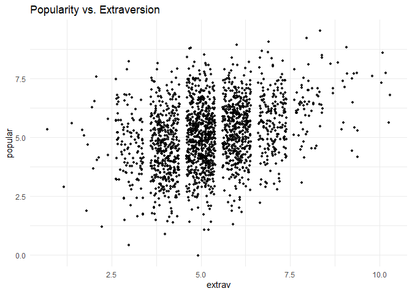<!-- -->

Now we can add a regression line to this plot.


```r
ggplot(data  = popular2data,
       aes(x = extrav,
           y = popular))+
  geom_point(size     = 1.2,
             alpha    = .8,
             position = "jitter")+ #to add some random noise for plotting purposes
  geom_smooth(method = lm,
              se     = FALSE, 
              col    = "black",
              size   = .5, 
              alpha  = .8)+ # to add regression line
  theme_minimal()+
  labs(title    = "Popularity vs. Extraversion",
       subtitle = "add regression line")
```

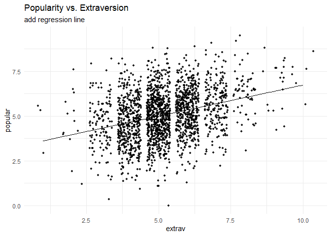<!-- -->

So far we have ignored the nested multilevel structure of the data. We can show this multilevel structure by colour coding the different classes.


```r
ggplot(data    = popular2data,
       aes(x   = extrav,
           y   = popular,
           col = class))+ #to add the colours for different classes
  geom_point(size     = 1.2,
             alpha    = .8,
             position = "jitter")+ #to add some random noise for plotting purposes
  theme_minimal()+
  theme(legend.position = "none")+
  scale_color_gradientn(colours = rainbow(100))+
  labs(title    = "Popularity vs. Extraversion",
       subtitle = "add colours for different classes")
```

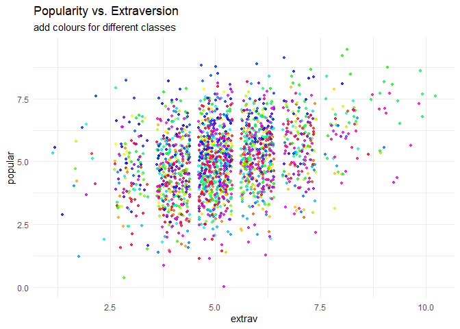<!-- -->

Now we can draw different regression lines for the 100 different classes in the data


```r
ggplot(data      = popular2data,
       aes(x     = extrav,
           y     = popular,
           col   = class,
           group = class))+ #to add the colours for different classes
  geom_point(size     = 1.2,
             alpha    = .8,
             position = "jitter")+ #to add some random noise for plotting purposes
  theme_minimal()+
  theme(legend.position = "none")+
  scale_color_gradientn(colours = rainbow(100))+
  geom_smooth(method = lm,
              se     = FALSE,
              size   = .5, 
              alpha  = .8)+ # to add regression line
  labs(title    = "Popularity vs. Extraversion",
       subtitle = "add colours for different classes and regression lines")
```

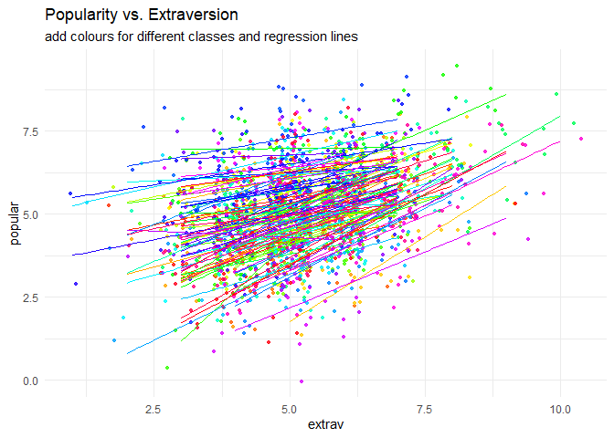<!-- -->

We clearly see that the relationship between extraversion and popularity is not the same in all classes, but on average there is a clear positive relationship. In this tutorial we will show the estimation of these different slopes (and how the explain these differences). Again, for more information please refer the book [Multilevel analysis: Techniques and applications](https://www.rensvandeschoot.com/multilevel-book/).  

We can also colour code the most extreme regression lines.


```r
# To colour code the extremes, we need to write a small function that calculates the regression lines and adds a collumn indicating which clusters have the most extreme.
f1 <- function(data, x, y, grouping, n.highest = 3, n.lowest = 3){
  groupinglevel <- data[,grouping]
  res           <- data.frame(coef = rep(NA, length(unique(groupinglevel))), group = unique(groupinglevel))
  names(res)    <- c("coef", grouping)
  for(i in 1:length(unique(groupinglevel))){
    data2    <- as.data.frame(data[data[,grouping] == i,])
    res[i,1] <- as.numeric(lm(data2[, y] ~ data2[, x])$coefficients[2])
  }
  top    <- res %>% top_n(n.highest, coef)
  bottom <- res %>% top_n(-n.lowest, coef)
  res    <- res %>% mutate(high_and_low = ifelse(coef %in% top$coef, "top",  ifelse(coef %in% bottom$coef, "bottom", "none")))
  data3  <- left_join(data, res)
  return(data3)
}
```
 
Now we can use this function on the popularity data.

```r
f1(data = as.data.frame(popular2data), 
   x    = "extrav",
   y    = "popular",
   grouping = "class",
   n.highest = 3, 
   n.lowest = 3) %>%
  ggplot()+
  geom_point(aes(x     = extrav,
                 y     = popular, 
                 fill  = class, 
                 group = class),
             size     =  1, 
             alpha    = .5, 
             position = "jitter", 
             shape    = 21, 
             col      = "white")+
  geom_smooth(aes(x     = extrav,
                  y     = popular,
                  col   = high_and_low,
                  group = class,
                  size  = as.factor(high_and_low),
                  alpha = as.factor(high_and_low)),
              method = lm,
              se     = FALSE)+
  theme_minimal()+
  theme(legend.position = "none")+
  scale_fill_gradientn(colours = rainbow(100))+
  scale_color_manual(values=c("top"      = "blue",
                              "bottom"   = "red",
                              "none"     = "grey40"))+
  scale_size_manual(values=c("top"       = 1.2,
                              "bottom"   = 1.2,
                              "none"     = .5))+
  scale_alpha_manual(values=c("top"      = 1,
                             "bottom"    = 1,
                             "none"      =.3))+
  labs(title="Linear Relationship Between Popularity and Extraversion for 100 Classes",
       subtitle="The 6 with the most extreme relationship have been highlighted red and blue")
```

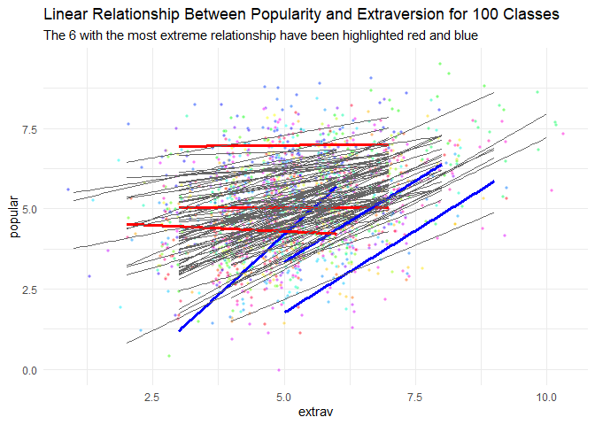<!-- -->

## Step 4: Analysing the Data


## Intercept only model
Since the brms package (via STAN) makes use of a Hamiltonian Monte Carlo sampler algorithm (MCMC) to approximate the posterior (distribution), we need to specify a few more parameters than in a frequentist analysis (using `lme4`). 


1.  First we need the specify how many iteration we want the MCMC to run.
2.  We need to specify how many chains we want to run.
3.  We need to specify how many iterations we want to discard per chain (warmup or burnin phase).
4.  We need to specify what our initial values are for the different chains for the parameters of interest. or we can just tell brms that we want random values as initial values.

We need to specify all these values for replicability purposes. In addition, if the two chains would not converge we can specify more iterations, different starting values and a longer warmup period. Thankfully brms will tell us if the sampler is likely to be non-converged. 

The first model that we replicate is the intercept only model.
If we look at the different inputs for the brm function we:

1.  have "popular", which indicates the dependent variable we want to predict.
2.  a "~", that we use to indicate that we now give the other variables of interest.
3.  a "1" in the formula the function indicates the intercept.
4.  since this is an intercept only model, we do not have any other independent variables here. 
5.  between brackets we have the random effects/slopes. Again the value 1 is to indicate the intercept and the variables right of the vertical "|" bar is used to indicate grouping variables. In this case the class ID. So the dependent variable 'popular' is predicted by a intercept and a random error term for the intercept. 
6.  Finally we specify which dataset we want to use after the "data=" command
For more information on the BRMS function which is based on the LMER function of the LME4 package see: https://cran.r-project.org/web/packages/lme4/lme4.pdf


```r
interceptonlymodeltest<-brm(popular ~ 1 + (1 | class),  data = popular2data, warmup = 100, iter = 200, chains = 2, inits= "random", cores = 2)  #the cores function tells STAN to make use of 2 CPU cores simultaneously instead of just 1.
```

```
## Compiling the C++ model
```

```
## Start sampling
```

```
## Warning: The largest R-hat is 1.19, indicating chains have not mixed.
## Running the chains for more iterations may help. See
## http://mc-stan.org/misc/warnings.html#r-hat
```

```
## Warning: Bulk Effective Samples Size (ESS) is too low, indicating posterior means and medians may be unreliable.
## Running the chains for more iterations may help. See
## http://mc-stan.org/misc/warnings.html#bulk-ess
```

```
## Warning: Tail Effective Samples Size (ESS) is too low, indicating posterior variances and tail quantiles may be unreliable.
## Running the chains for more iterations may help. See
## http://mc-stan.org/misc/warnings.html#tail-ess
```

```r
summary(interceptonlymodeltest)
```

```
## Warning: The model has not converged (some Rhats are > 1.1). Do not analyse the results! 
## We recommend running more iterations and/or setting stronger priors.
```

```
##  Family: gaussian 
##   Links: mu = identity; sigma = identity 
## Formula: popular ~ 1 + (1 | class) 
##    Data: popular2data (Number of observations: 2000) 
## Samples: 2 chains, each with iter = 200; warmup = 100; thin = 1;
##          total post-warmup samples = 200
## 
## Group-Level Effects: 
## ~class (Number of levels: 100) 
##               Estimate Est.Error l-95% CI u-95% CI Eff.Sample Rhat
## sd(Intercept)     0.85      0.07     0.72     0.97         28 1.10
## 
## Population-Level Effects: 
##           Estimate Est.Error l-95% CI u-95% CI Eff.Sample Rhat
## Intercept     5.07      0.10     4.90     5.29         13 1.20
## 
## Family Specific Parameters: 
##       Estimate Est.Error l-95% CI u-95% CI Eff.Sample Rhat
## sigma     1.11      0.02     1.07     1.14        208 1.00
## 
## Samples were drawn using sampling(NUTS). For each parameter, Eff.Sample 
## is a crude measure of effective sample size, and Rhat is the potential 
## scale reduction factor on split chains (at convergence, Rhat = 1).
```

For this model we have specified very few iterations and a short burn-in period, which yields the warning *"The model has not converged (some Rhats are > 1.1). Do not analyse the results!  We recommend running more iterations and/or setting stronger priors."* So we do so. From now on, to keep this tutorial of a reasonable length, the process of the BRMS MCMC sampler is no longer shown.


```r
interceptonlymodel <- brm(popular ~ 1 + (1|class),  
                          data = popular2data, 
                          warmup = 1000, iter = 3000, 
                          cores = 2, chains = 2, 
                          seed = 123) #to run the model
```


```r
summary(interceptonlymodel)
```

```
##  Family: gaussian 
##   Links: mu = identity; sigma = identity 
## Formula: popular ~ 1 + (1 | class) 
##    Data: popular2data (Number of observations: 2000) 
## Samples: 2 chains, each with iter = 3000; warmup = 1000; thin = 1;
##          total post-warmup samples = 4000
## 
## Group-Level Effects: 
## ~class (Number of levels: 100) 
##               Estimate Est.Error l-95% CI u-95% CI Eff.Sample Rhat
## sd(Intercept)     0.85      0.07     0.73     0.99        740 1.00
## 
## Population-Level Effects: 
##           Estimate Est.Error l-95% CI u-95% CI Eff.Sample Rhat
## Intercept     5.08      0.09     4.91     5.25        516 1.00
## 
## Family Specific Parameters: 
##       Estimate Est.Error l-95% CI u-95% CI Eff.Sample Rhat
## sigma     1.11      0.02     1.07     1.14       6613 1.00
## 
## Samples were drawn using sampling(NUTS). For each parameter, Eff.Sample 
## is a crude measure of effective sample size, and Rhat is the potential 
## scale reduction factor on split chains (at convergence, Rhat = 1).
```


Now we do not get any warnings and can check the results. We see that the intercept (mean) is 5.08 and that the credible interval ranges from 4.90 to 5.25. BRMS does not yet square the standard deviation of the intercept and the standard deviation of the first level, so if we want to calculate the Intraclass correlation (ICC) we need to do this ourselves. The posterior mean of the residual variance (our best guess for now) on the class level is  $0.85^2= .72$ and the residual variance on the first level (pupil level) is $1.11^2= 1.23$, which means that the ICC= $\frac{0.85^2}{(0.85^2+1.11^2)}=.37$

Alternatively we can also use of the following code to calculate the ICC. This function will also indicate if 0 is included in the 95% CCI of the ICC. In our example that is not case which means a multilevel model is warranted. 


```r
hyp <- "sd_class__Intercept^2 / (sd_class__Intercept^2 + sigma^2) = 0"
hypothesis(interceptonlymodel, hyp, class = NULL)
```

```
## Hypothesis Tests for class :
##                 Hypothesis Estimate Est.Error CI.Lower CI.Upper Evid.Ratio
## 1 (sd_class__Interc... = 0     0.37      0.04      0.3     0.45         NA
##   Post.Prob Star
## 1        NA    *
## ---
## 'CI': 90%-CI for one-sided and 95%-CI for two-sided hypotheses.
## '*': For one-sided hypotheses, the posterior probability exceeds 95%;
## for two-sided hypotheses, the value tested against lies outside the 95%-CI.
## Posterior probabilities of point hypotheses assume equal prior probabilities.
```

&nbsp;


## First Level Predictors
Now we can add first (student) level predictors. The first level predictors are sex and extraversion. For now, we just add them as fixed effects and not yet as random slopes. Furthermore, we do not yet specify any priors for the regression coefficients, which means that BRMS will pick priors that are non or very weakly informative, so that their influence on the results will be negligible.


```r
model1 <- brm(popular ~ 1 + sex + extrav + (1|class),  
              data = popular2data, 
              warmup = 1000, iter = 3000, 
              cores = 2, chains = 2, 
              seed = 123) #to run the model
```


```r
summary(model1)
```

```
##  Family: gaussian 
##   Links: mu = identity; sigma = identity 
## Formula: popular ~ 1 + sex + extrav + (1 | class) 
##    Data: popular2data (Number of observations: 2000) 
## Samples: 2 chains, each with iter = 3000; warmup = 1000; thin = 1;
##          total post-warmup samples = 4000
## 
## Group-Level Effects: 
## ~class (Number of levels: 100) 
##               Estimate Est.Error l-95% CI u-95% CI Eff.Sample Rhat
## sd(Intercept)     0.80      0.06     0.69     0.93        389 1.01
## 
## Population-Level Effects: 
##           Estimate Est.Error l-95% CI u-95% CI Eff.Sample Rhat
## Intercept     2.14      0.12     1.90     2.37        585 1.00
## sex           1.25      0.04     1.18     1.33       4125 1.00
## extrav        0.44      0.02     0.41     0.47       3382 1.00
## 
## Family Specific Parameters: 
##       Estimate Est.Error l-95% CI u-95% CI Eff.Sample Rhat
## sigma     0.77      0.01     0.75     0.79       4470 1.00
## 
## Samples were drawn using sampling(NUTS). For each parameter, Eff.Sample 
## is a crude measure of effective sample size, and Rhat is the potential 
## scale reduction factor on split chains (at convergence, Rhat = 1).
```

Again, we get no warnings and we can interpret the results. However because we now have multiple parameters of interest we can visualize the convergence in so-called caterpillar plots. We see that after a few iteration (far before the end of the warm up period of 3000), the 2 chains converge into a nice fat caterpillar. 


```r
model1tranformed <- ggs(model1) # the ggs function transforms the brms output into a longformat tibble, that we can use to make different types of plots.
```

```
## Warning in custom.sort(D$Parameter): NAs introduced by coercion
```

```r
ggplot(filter(model1tranformed, Parameter %in% c("b_Intercept", "b_extrav", "b_sex")),
       aes(x   = Iteration,
           y   = value, 
           col = as.factor(Chain)))+
  geom_line() +
  geom_vline(xintercept = 1000)+
  facet_grid(Parameter ~ . ,
             scale  = 'free_y',
             switch = 'y')+
  labs(title = "Caterpillar Plots", 
       col   = "Chains")
```

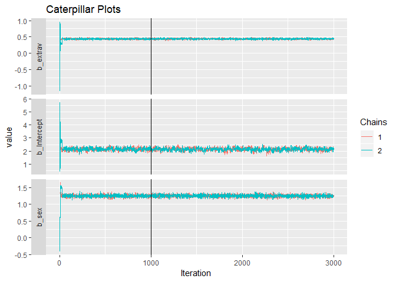<!-- -->

The intercept is now 2.14 (which represent the mean of the posterior distribution), the regression coefficient for sex is 1.25, and the regression coefficient for extraversion 0.44. In a Bayesian analysis we do not have p-values as we do have a frequentist analysis and corresponding hypothesis tests. To test whether all regression coefficients are different from zero, we can look at the Credible Intervals that are listed in the summary output or we can visually represent them in density plots. If we do so, we clearly see that zero is not included in any of the density plots, meaning that we can be reasonably certain the regression coefficients are different from zero.


```r
ggplot(filter(model1tranformed,
              Parameter == "b_Intercept", 
              Iteration > 1000),
       aes(x = value))+
  geom_density(fill  = "yellow", 
               alpha = .5)+
  geom_vline(xintercept = 0, 
             col  = "red",
             size = 1)+
  scale_x_continuous(name   = "Value",
                     limits = c(-1, 3)) + 
  geom_vline(xintercept = summary(model1)$fixed[1,3:4],
             col = "blue",
             linetype = 2) +
  theme_light() +
  labs(title = "Posterior Density of Intercept")
```

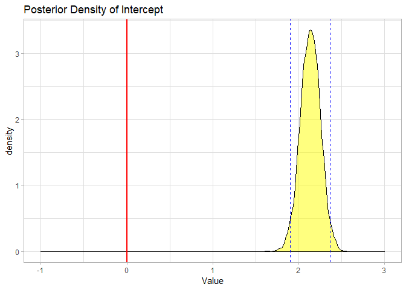<!-- -->

```r
ggplot(filter(model1tranformed, Parameter == "b_extrav", Iteration > 1000), aes(x = value))+
  geom_density(fill = "orange", alpha = .5)+
  geom_vline(xintercept = 0, col = "red", size = 1)+
  scale_x_continuous(name = "Value", limits = c(-.2, .6))+ 
  geom_vline(xintercept = summary(model1)$fixed[3,3:4], col = "blue", linetype = 2)+
  theme_light()+
  labs(title = "Posterior Density of Regression Coefficient for Extraversion")
```

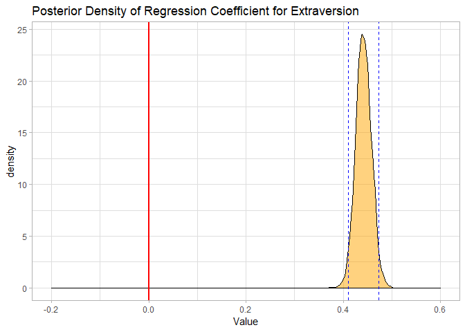<!-- -->

```r
ggplot(filter(model1tranformed, Parameter == "b_sex", Iteration > 1000), aes(x = value))+
  geom_density(fill = "red", alpha = .5)+
  geom_vline(xintercept = 0, col = "red", size = 1)+
  scale_x_continuous(name = "Value", limits = c(-.2, 1.5))+ 
  geom_vline(xintercept = summary(model1)$fixed[2,3:4], col = "blue", linetype = 2)+
  theme_light()+
  labs(title = "Posterior Density of Regression Coefficient for Sex")
```

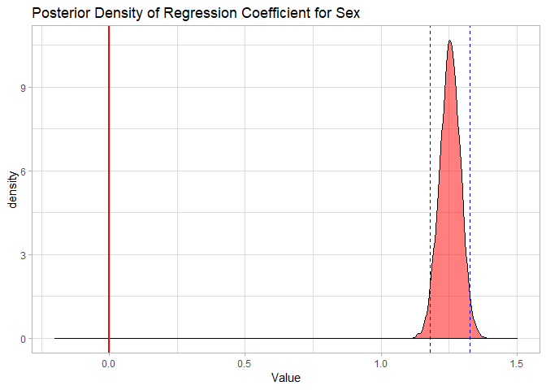<!-- -->

&nbsp;


## First and Second Level Predictors

We now also (in addition to the level 1 variables that were both significant) add a predictor variable on the second level (teacher experience).


```r
model2 <- brm(popular ~ 1 + sex + extrav + texp + (1|class),  
              data = popular2data, 
              warmup = 1000, iter = 3000, 
              cores = 2, chains = 2, 
              seed = 123)
```


```r
summary(model2)
```

```
##  Family: gaussian 
##   Links: mu = identity; sigma = identity 
## Formula: popular ~ 1 + sex + extrav + texp + (1 | class) 
##    Data: popular2data (Number of observations: 2000) 
## Samples: 2 chains, each with iter = 3000; warmup = 1000; thin = 1;
##          total post-warmup samples = 4000
## 
## Group-Level Effects: 
## ~class (Number of levels: 100) 
##               Estimate Est.Error l-95% CI u-95% CI Eff.Sample Rhat
## sd(Intercept)     0.55      0.04     0.47     0.64        822 1.00
## 
## Population-Level Effects: 
##           Estimate Est.Error l-95% CI u-95% CI Eff.Sample Rhat
## Intercept     0.80      0.17     0.47     1.13        891 1.00
## sex           1.25      0.04     1.18     1.33       6064 1.00
## extrav        0.45      0.02     0.42     0.49       5283 1.00
## texp          0.09      0.01     0.07     0.11        609 1.01
## 
## Family Specific Parameters: 
##       Estimate Est.Error l-95% CI u-95% CI Eff.Sample Rhat
## sigma     0.77      0.01     0.75     0.80       5604 1.00
## 
## Samples were drawn using sampling(NUTS). For each parameter, Eff.Sample 
## is a crude measure of effective sample size, and Rhat is the potential 
## scale reduction factor on split chains (at convergence, Rhat = 1).
```

We can see that both the level 1 and level 2 variables are different from zero (0 is not included in any of the CCIs) However, we have not added random slopes yet for any variables (as is done in table 2.1 in the book).

We can now also calculate the explained variance at level 1 and at level 2.

*  For level 1 this is $\frac{1.11^2-0.77^2}{1.11^2}=.52$
*  For level 2 this is $\frac{.85^2-0.55^2}{.85^2}=.58$

&nbsp;

## First and Second Level Predictors with Random Slopes (1)
We also want to include random slopes. In the third column of Table 2.1, both predictor variables from level 1 (sex and extraversion) have random slopes. To accomplish this in BRMS just add the variables for which we want to add random slopes to the random part of  the input. This means that "(1|class)" becomes "(1+sex+extrav |class)"


```r
model3 <- brm(popular ~ 1 + sex + extrav + (1 + sex + extrav | class),  
              data = popular2data, 
              warmup = 1000, iter = 3000, 
              cores = 2, chains = 2, 
              seed = 123) #to run the model
```


```r
summary(model3)
```

```
##  Family: gaussian 
##   Links: mu = identity; sigma = identity 
## Formula: popular ~ 1 + sex + extrav + (1 + sex + extrav | class) 
##    Data: popular2data (Number of observations: 2000) 
## Samples: 2 chains, each with iter = 3000; warmup = 1000; thin = 1;
##          total post-warmup samples = 4000
## 
## Group-Level Effects: 
## ~class (Number of levels: 100) 
##                       Estimate Est.Error l-95% CI u-95% CI Eff.Sample Rhat
## sd(Intercept)             1.61      0.15     1.34     1.94        874 1.00
## sd(sex)                   0.08      0.05     0.00     0.19        808 1.00
## sd(extrav)                0.17      0.02     0.13     0.22        827 1.00
## cor(Intercept,sex)       -0.18      0.42    -0.88     0.68       4229 1.00
## cor(Intercept,extrav)    -0.93      0.03    -0.97    -0.86        891 1.00
## cor(sex,extrav)           0.03      0.43    -0.79     0.84        550 1.00
## 
## Population-Level Effects: 
##           Estimate Est.Error l-95% CI u-95% CI Eff.Sample Rhat
## Intercept     2.09      0.18     1.72     2.44        576 1.00
## sex           1.24      0.04     1.17     1.32       5761 1.00
## extrav        0.44      0.02     0.40     0.49        951 1.00
## 
## Family Specific Parameters: 
##       Estimate Est.Error l-95% CI u-95% CI Eff.Sample Rhat
## sigma     0.74      0.01     0.72     0.77       4408 1.00
## 
## Samples were drawn using sampling(NUTS). For each parameter, Eff.Sample 
## is a crude measure of effective sample size, and Rhat is the potential 
## scale reduction factor on split chains (at convergence, Rhat = 1).
```

We can see that all the fixed regression slopes are still different from 0. However, no significance test for the Random Effects are given, but we do see that the error term (Variance) for the slope of the variable sex is estimated to be very small $0.06^2=0.0036$. This probably  means that there is no slope variation of the sex variable between classes and therefore the random slope estimation can be dropped from the next analyses. Since a negative variance is not possible the posterior distribution of the random term is truncated at 0, in the summary output we do see though that 0 falls in the 95% CCI, and therefore we have no strong evidence it is different than 0.

&nbsp;


## First and Second Level Predictors with Random Slopes (2)

We continue after omitting the random slope of sex.


```r
model4 <- brm(popular ~ 1 + sex + extrav + texp + (1 + extrav | class),  
              data = popular2data, 
              warmup = 1000, iter = 3000, 
              cores = 2, chains = 2, 
              seed = 123) #to run the model
```


```r
summary(model4)
```

```
##  Family: gaussian 
##   Links: mu = identity; sigma = identity 
## Formula: popular ~ 1 + sex + extrav + texp + (1 + extrav | class) 
##    Data: popular2data (Number of observations: 2000) 
## Samples: 2 chains, each with iter = 3000; warmup = 1000; thin = 1;
##          total post-warmup samples = 4000
## 
## Group-Level Effects: 
## ~class (Number of levels: 100) 
##                       Estimate Est.Error l-95% CI u-95% CI Eff.Sample Rhat
## sd(Intercept)             1.12      0.14     0.85     1.41       1239 1.00
## sd(extrav)                0.18      0.02     0.14     0.23        996 1.00
## cor(Intercept,extrav)    -0.87      0.04    -0.93    -0.77       1347 1.00
## 
## Population-Level Effects: 
##           Estimate Est.Error l-95% CI u-95% CI Eff.Sample Rhat
## Intercept     0.72      0.24     0.27     1.20       1046 1.00
## sex           1.25      0.04     1.18     1.32       8790 1.00
## extrav        0.45      0.02     0.40     0.50       2867 1.00
## texp          0.09      0.01     0.07     0.12        637 1.00
## 
## Family Specific Parameters: 
##       Estimate Est.Error l-95% CI u-95% CI Eff.Sample Rhat
## sigma     0.74      0.01     0.72     0.77       6588 1.00
## 
## Samples were drawn using sampling(NUTS). For each parameter, Eff.Sample 
## is a crude measure of effective sample size, and Rhat is the potential 
## scale reduction factor on split chains (at convergence, Rhat = 1).
```


We see that:

*  The estimate for the intercept is $0.72 [0.28; 1.18]$
*  The estimate for the fixed effect of sex is $1.25 [1.18; 1.32]$
*  The estimate for the effect of teacher experience is $0.09 [0.07; 0.12]$
*  The estimate for the mean effect of extraversion is $0.45 [0.40; 0.50]$
*  The estimate for the random effect of the slope of extraversion is $.18^2=.032 [0.14^2;0.23^2]$ (some of these estimates might slightly different for you or than in the book, due to squaring after rounding)
*  The estimate for the First level residual variance is $0.74^2=.55 [0.72^2;0.77^2]$
*  The estimate for the residual variance on the second level is $1.13^2=1.28 [0.87^2;1.42^2]$


&nbsp;


## First and Second Level Predictors with Random Slopes and Crosslevel Interaction

As a final step we can add a cross-level interaction between teacher experience and extraversion (since this had a significant random effect, that we might be able to explain). In this next step to reproduce Model M2 from Table 2.3 of the book, we add the cross-level interaction between Extraversion and Teacher experience. This means we have to add texp as a predictor for the coefficient of extrav The cross level interaction term between extraversion and teacher experience can be created by the ':' sign or by multiplying the terms.

If we put all of this in formula form we get: $Popularity_{ij}=\beta_{0j}+\beta_1*gender_{ij}+ \beta_{2j}*extraversion_{ij}+e_{ij}$. 

In which $\beta_{0j}=\gamma_{00}+\gamma_{01}*experience_j+u_{0j}$  and  $\beta_{2j}= \gamma_{20}+\gamma_{21}*experience_j+u_{2j}$

Combined we get:

$$Popularity_{ij}= \gamma_{00}+\gamma_{10}*sex_{ij}+\gamma_{20}*extraversion_{ij}+\gamma_{01}*experience_j+\gamma_{21}*extraversion_{ij}*experience_j+u_{2j}*extraversion_{ij}+u_{0j}+e_{ij}$$


```r
model5 <- brm(popular ~ 1 + sex + extrav + texp + extrav:texp + (1 + extrav|class), 
              data  = popular2data, warmup = 1000,
              iter  = 3000, chains = 2, 
              seed  = 123, control = list(adapt_delta = 0.97),
              cores = 2) # to reach a usuable number effective samples in the posterior distribution of the interaction effect, we need many more iteration. This sampler will take quite some time and you might want to run it with a few less iterations. 
```

Because we are looking at some small estimates, we need more than 3 decimal points. These decimals are acquired with the following command:


```r
summary(model5)$fixed
```

```
## Warning: There were 234 divergent transitions after warmup. Increasing adapt_delta above 0.97 may help.
## See http://mc-stan.org/misc/warnings.html#divergent-transitions-after-warmup
```

```
##                Estimate   Est.Error    l-95% CI    u-95% CI Eff.Sample
## Intercept   -1.21316507 0.259965469 -1.72527083 -0.70658588   1885.434
## sex          1.23926184 0.036729302  1.16671462  1.30829842   4159.152
## extrav       0.80392992 0.038941005  0.72891187  0.88114305   2265.667
## texp         0.22634748 0.015922294  0.19538130  0.25739669   1757.210
## extrav:texp -0.02470317 0.002453314 -0.02951744 -0.01988758   2234.876
##                  Rhat
## Intercept   0.9995886
## sex         0.9996308
## extrav      0.9995619
## texp        0.9997630
## extrav:texp 0.9995858
```

```r
summary(model5)$random
```

```
## Warning: There were 234 divergent transitions after warmup. Increasing adapt_delta above 0.97 may help.
## See http://mc-stan.org/misc/warnings.html#divergent-transitions-after-warmup
```

```
## $class
##                          Estimate Est.Error     l-95% CI  u-95% CI
## sd(Intercept)          0.62215539 0.1034839  0.449022873 0.8544939
## sd(extrav)             0.04621475 0.0310829  0.001630236 0.1055989
## cor(Intercept,extrav) -0.38531230 0.4306381 -0.910388316 0.7986089
##                       Eff.Sample     Rhat
## sd(Intercept)           333.0255 1.004880
## sd(extrav)              116.9502 1.017597
## cor(Intercept,extrav)   523.4056 1.002699
```


The interaction term is denoted by 'extrav:texp' under 'Fixed effects' and is estimated at -0.0247.

As explained in the book and shown in the results, both the intercept and the slope of the coefficient of extraversion on popularity is influenced by teacher experience. A male student (SEX = 0) with a extraversion score of 0 in a class with a teacher with 0 years of experience has an expected popularity of -1.206 (these values are of course impossible,  centering is a good strategy to prevent these impossible results). A similar (male) student will improve its popularity with 0.803 points for every point more extraversion. When teacher experiences increases, the intercept also increases with 0.226 for every year of experience. So the same male student with no extraversion in a class with a teacher with 15 years of experience has an expected popularity score of  -1.206 + (15 x .226) = 2.184. The teacher experience also lessens the effect of extraversion on popularity. For a teacher with 15 years of experience the regression coefficient of extraversion on popularity is only 0.803-(15x0.0247)=0.433 (compared to 0.803 in a class with a teacher with 0 years of experience).

&nbsp;

In a plot we can also clearly see that years of teacher experience has influence on both the intercept and the regression coefficient of extraversion on popularity. 


```r
ggplot(data = popular2data, 
       aes(x   = extrav,
           y   = popular,
           col = as.factor(texp)))+
  viridis::scale_color_viridis(discrete = TRUE)+
  geom_point(size     = .7,
             alpha    = .8,
             position = "jitter")+
  geom_smooth(method = lm,
              se     = FALSE, 
              size   = 2,
              alpha  = .8)+
  theme_minimal()+
  labs(title    = "Linear Relationship for Different Years of Teacher Experience as Observed", 
       subtitle = "The linear relationship between the two is not the same for all classes", 
       col      = "Years of\nTeacher\nExperience")
```

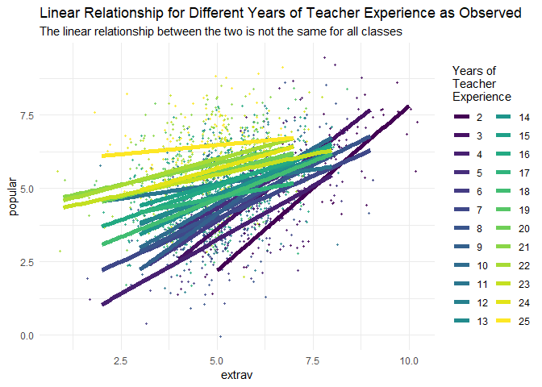<!-- -->

If you want to plot this in a Bayesian way, you could run a simple model and show the different posteriors of the regression slope of extraversion in the 100 different classes.


```r
simplemodel1 <- brm(popular ~ 1 + extrav + (1 + extrav | class), 
                  data = popular2data,
                  warmup = 1000, iter = 5000, chains = 2,  
                  seed = 123, control = list(adapt_delta = 0.96), 
                  save_all_pars = TRUE, cores= 2)


posteriorsimpelmodel1 <- as_tibble(t(posterior_samples(simplemodel1, pars = "extrav")[,-c(1:3)]))

teacherexperience <- popular2data %>%
  group_by(class) %>%
  summarise("teacherexperience" = mean(texp))

posteriorsimpelmodellong <- bind_cols(teacherexperience, posteriorsimpelmodel1) %>%
gather(key = "key", value = "value", -teacherexperience, -class)%>%
  group_by(class) %>%
  mutate(meanperclass = mean(value))%>%
  ungroup()
```


```r
ggplot()+
  ggridges::geom_density_ridges(data  = posteriorsimpelmodellong, 
                                aes(x      = value,
                                    y      = reorder(as.factor(class), meanperclass),
                                    height = ..density.., 
                                    fill   = as.factor(teacherexperience)),
                                scale = 3, 
                                alpha = .6) +
  scale_x_continuous(limits = c(-.5,.5))+
  geom_point(data = summarise(group_by(posteriorsimpelmodellong, class), mean = mean(meanperclass)),
             aes(x = mean, 
                 y = as.factor(class)),
             size = 1, 
             col  = "red")+
  viridis::scale_fill_viridis(discrete = TRUE)+
  geom_vline(xintercept = 0, 
             col        = "red")+
  labs(fill     = "Years of\nTeacher\nExperience",
       y        = "classes", 
       title    = expression(paste("Class Level Error of Regression Coefficient of Extraversion on Popularity (", u["2j"],")")),
       subtitle = expression(paste("posterior distribution of class level error of regression coefficient (", u["2j"],") per class with the means in red")), 
       caption  = expression(paste("Regression formula: popularity = ", gamma["00"], "+", gamma["20"],"*", extrav["ij"], "+", u["2j"], "*", extrav["ij"],"+", e["ij"] )))+
  annotate(geom     = "text", 
           x        = 0, 
           y        = 1.5, 
           label    = "Grand mean", 
           col      = "red", 
           family   = theme_get()$text[["family"]], 
           size     = theme_get()$text[["size"]]/3, 
           fontface = "italic")+
  theme_tufte()
```

```
## Picking joint bandwidth of 0.0125
```

```
## Warning: Removed 2404 rows containing non-finite values
## (stat_density_ridges).
```

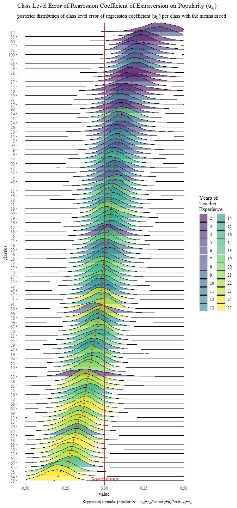<!-- -->

A plot like this would not be possible in a frequentist analysis. From the width of the different posterior distributions we can see that for the classes with a teacher with less experience we are less sure about the deviation. This means that we are less sure about estimate of the deviation from the mean for teachers with relatively little experience and are more sure about the random coefficient for classes with a more experienced teacher. We can investigate whether such relation (linear and/or quadratic) actually exists by plottig the distance between the 0.025 and 0.975 CCI for different levels of teaching experience. If we do so, we see that there indeed is a quadratic (and linear) effect and we also see (again) that classes with a teacher with more experience have a postitive estimate of the second level error term.  


```r
distance95 <- posteriorsimpelmodellong %>%
  group_by(class) %>%
  summarise(lower95      = quantile(value, probs = .025),
            upper95      = quantile(value, probs = .975),
            distance     = upper95-lower95, 
            Meanestimate = mean(value)) %>%
  bind_cols(teacherexperience)%>%
  group_by(teacherexperience)%>%
  summarise(mean         = mean(distance), 
            Meanestimate = mean(Meanestimate),
            lower        = mean(lower95), 
            upper        = mean(upper95),
            meanCCI      = paste("[",sprintf("%.4f",round(lower,4)), ":", sprintf("%.4f",round(upper,4)), "]")) 

distance95 <- mutate(distance95, Quadratic = teacherexperience^2)

model <- lm(mean ~ teacherexperience + Quadratic, data = distance95)

summary(model)
```

```
## 
## Call:
## lm(formula = mean ~ teacherexperience + Quadratic, data = distance95)
## 
## Residuals:
##       Min        1Q    Median        3Q       Max 
## -0.038912 -0.006452 -0.000093  0.005897  0.040058 
## 
## Coefficients:
##                     Estimate Std. Error t value Pr(>|t|)    
## (Intercept)        4.491e-01  1.351e-02  33.234  < 2e-16 ***
## teacherexperience -1.197e-02  2.285e-03  -5.239 3.42e-05 ***
## Quadratic          3.368e-04  8.251e-05   4.081 0.000535 ***
## ---
## Signif. codes:  0 '***' 0.001 '**' 0.01 '*' 0.05 '.' 0.1 ' ' 1
## 
## Residual standard error: 0.01728 on 21 degrees of freedom
## Multiple R-squared:  0.6983,	Adjusted R-squared:  0.6696 
## F-statistic:  24.3 on 2 and 21 DF,  p-value: 3.434e-06
```

```r
dat <- data.frame(teacherexperience = c(2:25),
                  Quadratic         = c(2:25)^2)

dat$yhat <- predict(model, dat)

ggplot()+
  geom_line(data  = dat, 
            aes(x = teacherexperience,
                y = yhat), 
            linetype = "dotted",
            size     = 1)+
  geom_point(data = distance95, 
             aes(x   = teacherexperience, 
                 y   = mean, 
                 col = Meanestimate))+
  geom_text(data  = distance95, 
            aes(x     = teacherexperience, 
                y     = mean, 
                label = meanCCI,
                col   = Meanestimate),
            hjust    = .5, 
            vjust    = -.15, 
            family   = theme_get()$text[["family"]], 
            size     = 3, 
            fontface = "italic")+
  annotate(geom = "text", 
           x    = 15, 
           y    = 0.44,
           label    = "CCI distance=0.45-0.013*texp+0.00036*texp^2\nR^2=0.79", 
           colour   = "black",  
           family   = theme_get()$text[["family"]], 
           size     = theme_get()$text[["size"]]/2, 
           fontface = "italic")+
  viridis :: scale_color_viridis(discrete = F)+
  labs(y        = "95% CCI distance",
       title    = expression(paste("Mean CCI Distance of Posterior of (", u["2j"], ") for Different Years of Texp")),
       subtitle = "In brackets the actual CCIs and in colour the parameter estimate",
       col      = expression(paste("estimate ", u["2j"])))+
  scale_x_continuous(breaks = 2:25)+
  theme_tufte()
```

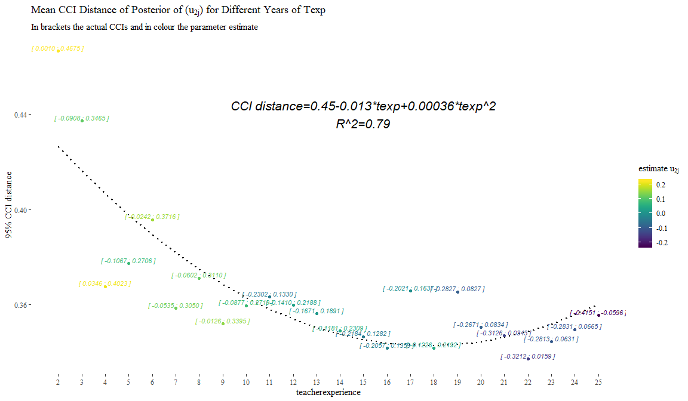<!-- -->


---
#### Brms Reference

[Burkner, P. C. (2017). brms: An R package for Bayesian multilevel models using Stan. Journal of Statistical Software, 80(1), 1-28.](https://www.jstatsoft.org/article/view/v080i01)

---
