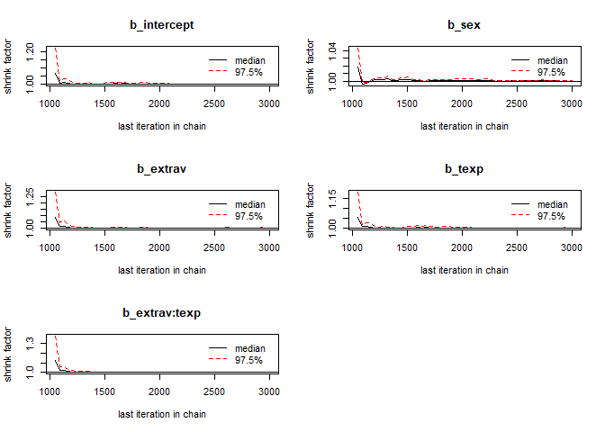
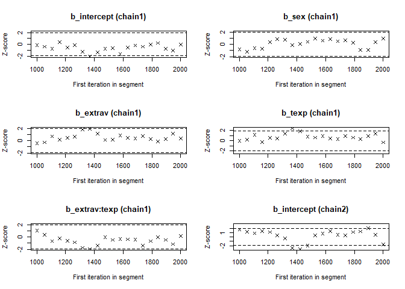
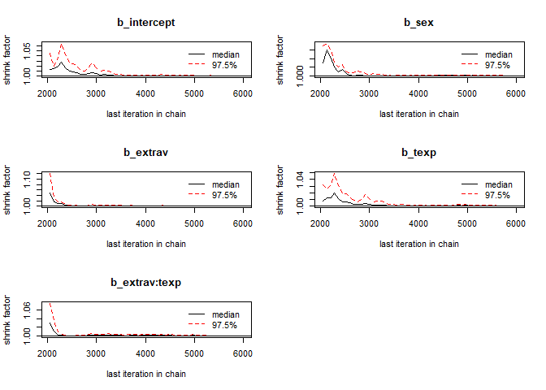
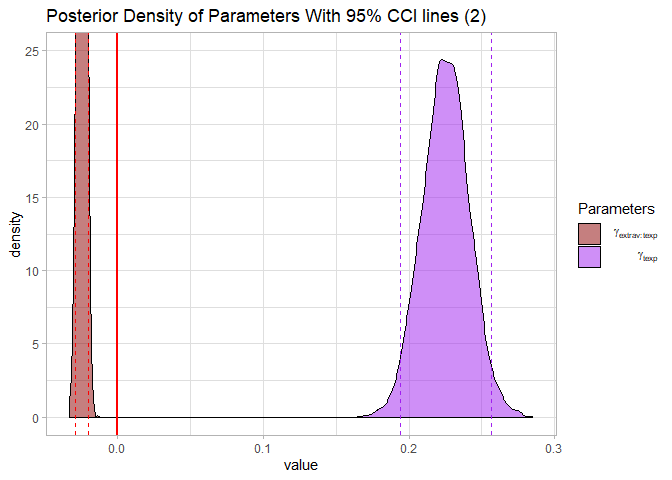

## Introduction
In this tutorial you will be following the steps of the When-to-Worry-and-How-to-Avoid-the-Misuse-of-Bayesian-Statistics - checklist [(the WAMBS-checklist)](https://www.rensvandeschoot.com/wambs-checklist/) to analyze the cross level interaction model we did in the [BRMS Tutorial.](https://www.rensvandeschoot.com/tutorials/brms-started/) **This is part 3 of a 3 part [series](https://www.rensvandeschoot.com/tutorials/brms/) on how to do multilevel models in BRMS. In [part 1](https://www.rensvandeschoot.com/tutorials/brms-started/) we explained how to step by step build the multilevel model we will use here and in [part 2](https://www.rensvandeschoot.com/tutorials/brms-priors/) we looked at the influence of different priors.** 

  <p>&nbsp;</p>


## Preparation
This tutorial expects:

-  Basic knowledge of multilevel analyses (the first two chapters of the book are sufficient).
-  Basic knowledge of coding in R, specifically the [LME4 package](https://www.rensvandeschoot.com/tutorials/lme4/).
-  Basic knowledge of Bayesian Statistics.
- Installation of [STAN](https://mc-stan.org/users/interfaces/rstan) and [Rtools](https://cran.r-project.org/bin/windows/Rtools). For more information please see https://github.com/stan-dev/rstan/wiki/RStan-Getting-Started
- Installation of R packages `rstan`, and `brms`. This tutorial was made using brms version 2.9.0 in R version 3.6.1
- Basic knowledge of [Bayesian](https://www.rensvandeschoot.com/a-gentle-introduction-to-bayesian-analysis-applications-to-developmental-research/) inference.
- Completed part 1 and 2 of the [series](https://www.rensvandeschoot.com/tutorials/brms/)
  


[expand title= Check the WAMBS checklist here]


## **WAMBS checklist** 

### *When to worry, and how to Avoid the Misuse of Bayesian Statistics*

**To be checked before estimating the model**

1. Do you understand the priors?

**To be checked after estimation but before inspecting model results**

2. Does the trace-plot exhibit convergence?
3. Does convergence remain after doubling the number of iterations?
4.   Does the posterior distribution histogram have enough information?
5.   Do the chains exhibit a strong degree of autocorrelation?
6.   Do the posterior distributions make substantive sense?

**Understanding the exact influence of the priors**

7. Do different specification of the multivariate variance priors influence the results?
8.   Is there a notable effect of the prior when compared with non-informative priors?
9.   Are the results stable from a sensitivity analysis?
10.   Is the Bayesian way of interpreting and reporting model results used?

[/expand]

  <p>&nbsp;</p>
  
## Packages and Data
The main package that is used for this analysis is [brms](https://cran.r-project.org/web/packages/brms/brms.pdf). In order to make this package function it need to call on STAN and a C++ compiler in the R extension Rtools. For more information and a tutorial on how to install these please have a look at: https://github.com/stan-dev/rstan/wiki/RStan-Getting-Started and https://cran.r-project.org/bin/windows/Rtools/.


> "Because brms is based on Stan, a C++ compiler is required. The program Rtools (available on https://cran.r-project.org/bin/windows/Rtools/) comes with a C++ compiler for Windows. On Mac, you should use Xcode. For further instructions on how to get the compilers running, see the prerequisites section at the RStan-Getting-Started page." ~ quoted from the BRMS package document:

After you installed the aforementioned software you need to load some other R packages. If you have not yet installed all below mentioned packages, you can install them by the command install.packages("NAMEOFPACKAGE")


```r
library(brms) # for the analysis
library(haven) # to load the SPSS .sav file
library(tidyverse) # needed for data manipulation.
library(RColorBrewer) # needed for some extra colours in one of the graphs
library(ggmcmc)
library(mcmcplots) 
```

To download the popularity data go to https://multilevel-analysis.sites.uu.nl/datasets/ and follow the links to https://github.com/MultiLevelAnalysis/Datasets-third-edition-Multilevel-book/blob/master/chapter%202/popularity/SPSS/popular2.sav. We will use the .sav file which can be found in the SPSS folder. After downloading the data to your working directory you can open it with the read_sav() command.

Alternatively, you can directly download them from GitHub into your R work space using the following command:

```r
popular2data <- read_sav(file  = "https://github.com/MultiLevelAnalysis/Datasets-third-edition-Multilevel-book/blob/master/chapter%202/popularity/SPSS/popular2.sav?raw=true")
```

There are some variables in the dataset that we do not use, so we can select the variables we will use and have a look at the first few observations.


```r
popular2data <- select(popular2data, pupil, class, extrav, sex, texp, popular) # we select just the variables we will use
head(popular2data) # we have a look at the first 6 observations
```

```
## # A tibble: 6 x 6
##   pupil class extrav       sex  texp popular
##   <dbl> <dbl>  <dbl> <dbl+lbl> <dbl>   <dbl>
## 1     1     1      5  1 [girl]    24     6.3
## 2     2     1      7  0 [boy]     24     4.9
## 3     3     1      4  1 [girl]    24     5.3
## 4     4     1      3  1 [girl]    24     4.7
## 5     5     1      5  1 [girl]    24     6  
## 6     6     1      4  0 [boy]     24     4.7
```

  <p>&nbsp;</p>
  

## The model

For this tutorial we make use of the multilevel crosslevel model (Model M2 from Table 2.3 in the book) we developed in the BRMS Tutorial. We have a main effect of sex, a random effect of Extravesion and a cross-level interaction between Extraversion and Teacher experience. This means we have to add texp as a predictor for the coefficient of extrav The cross level interaction term between extraversion and teacher experience can be created by the ':' sign or by multiplying the terms.

If we put all of this in formula form we get: $Popularity_{ij}=\beta_{0j}+\beta_1*gender_{ij}+ \beta_{2j}*extraversion_{ij}+e_{ij}$. 

In which $\beta_{0j}=\gamma_{00}+\gamma_{01}*experience_j+u_{0j}$  and  $\beta_{2j}= \gamma_{20}+\gamma_{21}*experience_j+u_{2j}$

Combined we get:

$$Popularity_{ij}= \gamma_{00}+\gamma_{10}*sex_{ij}+\gamma_{20}*extraversion_{ij}+\gamma_{01}*experience_j+\gamma_{21}*extraversion_{ij}*experience_j+u_{2j}*extraversion_{ij}+u_{0j}+e_{ij}$$

  <p>&nbsp;</p>
  
### 1.Do you understand the priors?

With the get_prior() command we can see which priors we can specify for this model. 


```r
get_prior(popular ~ 0 + intercept + sex + extrav + texp + extrav:texp + (1 + extrav|class), data = popular2data)
```

```
##                  prior class        coef group resp dpar nlpar bound
## 1                          b                                        
## 2                          b      extrav                            
## 3                          b extrav:texp                            
## 4                          b   intercept                            
## 5                          b         sex                            
## 6                          b        texp                            
## 7               lkj(1)   cor                                        
## 8                        cor             class                      
## 9  student_t(3, 0, 10)    sd                                        
## 10                        sd             class                      
## 11                        sd      extrav class                      
## 12                        sd   Intercept class                      
## 13 student_t(3, 0, 10) sigma
```

In this tutorial we will only specify priors for:

1. The regression coefficient of extrav $\gamma_{20}$ 
2. The regression coefficient of sex $\gamma_{10}$ 
3. The regression coefficient of texp $\gamma_{01}$ 
4. The regression coefficient of extrav:texp  $\gamma_{21}$ 
5. The intercept  $\gamma_{00}$ 

Since we are using a interaction effect and we are working with uncentered independent variables, the intercept will no longer be just a mean, but the value when all other values are zero even if this are impossible values. We can therefore not be very sure about the intercept and therefore we will give it a cauchy distribution with a shape parameter of 10. Based on earlier literature we might be fairly sure that that girls have a higher popularity than boys and will thus give its regression coefficient a normal distribution with a mean of 2 and a sigma (standard deviation) of .2. For teacher experience and extraverion we might be a bit less sure, because we are using interaction effects for these which means that the individual effects of these independent variables are now dependent on each other. Because of that, we decide to pick a wide normal distribution with a mean of 0 and a sigma (standard deviation) of 5. We are fairly sure about a negative interaction effect so we pick a normal distribution with a mean of -1 and a sigma (standard deviation) of .3 for the regression coefficient of extrav:texp.


```r
PRIORS <- c(set_prior("normal(0,5)",   class = "b", coef= "extrav"),
            set_prior("normal(-1,.3)", class = "b", coef= "extrav:texp"),
            set_prior("normal(2,.2)",  class = "b", coef= "sex"),
            set_prior("normal(0,5)",   class = "b", coef= "texp"),
            set_prior("cauchy(0,10)",  class = "b", coef = "intercept" ))

model <- brm(popular ~ 0 + intercept + sex + extrav + texp + extrav:texp + (1 + extrav|class), 
            data          = popular2data,
            warmup        = 1000, 
            iter          = 3000,
            chains        = 3, 
            control       = list(adapt_delta = 0.96), 
            prior         = PRIORS,
            save_all_pars = TRUE,
            sample_prior  = TRUE,
            cores         = 3, # the cores function tells STAN to make use of 3 CPU cores simultaneously instead of just 1.
            seed          = 123) 
```


  <p>&nbsp;</p>
  

### 2. Does the trace-plot exhibit convergence?

Before interpreting results, one should inspect the convergence of the chains that form the posterior distribution of the model parameters. A straightforward and common way to visualize convergence is the trace plot that illustrates the iterations of the chains from start to end.


```r
modeltranformed <- ggs(model) # the ggs function transforms the BRMS output into a longformat tibble, that we can use to make different types of plots.
```

```
## Warning in custom.sort(D$Parameter): NAs introduced by coercion
```

```r
ggplot(filter(modeltranformed, Parameter %in% c("b_intercept", "b_extrav", "b_sex", "b_extrav:texp", "b_texp", "sigma"),
              Iteration > 1000),
       aes(x   = Iteration,
           y   = value, 
           col = as.factor(Chain)))+
  geom_line()+
  facet_grid(Parameter ~ .,
             scale  = 'free_y',
             switch = 'y')+
  labs(title = "Caterpillar Plots",
       col   = "Chains")
```

<!-- -->


Alternatively, you can simply make use of the built-in plotting capabilities of Rstan.


```r
stanplot(model, type = "trace")
```

```
## No divergences to plot.
```

<!-- -->


We can check if the chains convergenced by having a look at the convergence diagnostics. Two of these diagnostics of interest include the Gelman and Rubin diagnostic and the Geweke diagnostic. 

* The Gelman-Rubin Diagnostic shows the PSRF values (using the  within and between chain variability). You should look at the Upper CI/Upper limit, which are all should be close to 1. If they aren't close to 1, you should use more iterations. Note: The Gelman and Rubin diagnostic is also automatically given in the summary of brms under the column Rhat 
* The Geweke Diagnostic shows the z-scores for a test of equality of means between the first and last parts of each chain, which should be <1.96. A separate statistic is calculated for each variable in each chain. In this way it check whether a chain has stabalized. If this is not the case, you should increase the number of iterations. In the plots you should check how often values exceed the boundary lines of the z-scores. Scores above 1.96  or below -1.96 mean that the two portions of the chain significantly differ and full chain convergence was not obtained.


To obtain the Gelman and Rubin diagnostic use:

```r
modelposterior <- as.mcmc(model) # with the as.mcmc() command we can use all the CODA package convergence statistics and plotting options
gelman.diag(modelposterior[, 1:5])
```

```
## Potential scale reduction factors:
## 
##               Point est. Upper C.I.
## b_intercept            1          1
## b_sex                  1          1
## b_extrav               1          1
## b_texp                 1          1
## b_extrav:texp          1          1
## 
## Multivariate psrf
## 
## 1
```

```r
gelman.plot(modelposterior[, 1:5])
```

<!-- -->

To obtain the Geweke diagnostic use:

```r
geweke.diag(modelposterior[, 1:5])
```

```
## [[1]]
## 
## Fraction in 1st window = 0.1
## Fraction in 2nd window = 0.5 
## 
##   b_intercept         b_sex      b_extrav        b_texp b_extrav:texp 
##      -0.10283      -0.83492      -0.38782      -0.05286       1.04557 
## 
## 
## [[2]]
## 
## Fraction in 1st window = 0.1
## Fraction in 2nd window = 0.5 
## 
##   b_intercept         b_sex      b_extrav        b_texp b_extrav:texp 
##         1.689        -1.106        -2.138        -2.348         2.664 
## 
## 
## [[3]]
## 
## Fraction in 1st window = 0.1
## Fraction in 2nd window = 0.5 
## 
##   b_intercept         b_sex      b_extrav        b_texp b_extrav:texp 
##       0.07574       0.04133       0.32670      -0.21333      -0.14698
```

```r
geweke.plot(modelposterior[, 1:5])
```

<!-- --><!-- --><!-- -->

Now we see that the Gelman and Rubin diagnostic (PRSF) is close to 1 for all parameters and the the Geweke diagnostic is not > 1.96.

  <p>&nbsp;</p>
  

### 3. Does convergence remain after doubling the number of iterations?
As is recommended in the WAMBS checklist, we double the amount of iterations to check for local convergence.


```r
modeldoubleniter <- brm(popular ~ 0 + intercept + sex + extrav + texp + extrav:texp + (1 + extrav|class), 
            data          = popular2data,
            warmup        = 2000, 
            iter          = 6000,
            chains        = 3, 
            control       = list(adapt_delta = 0.96), 
            prior         = PRIORS,
            save_all_pars = TRUE,
            sample_prior  = TRUE,
            cores         = 3, # the cores function tells STAN to make use of 3 CPU cores simultaneously instead of just 1.
            seed          = 123) 
```


```r
modeldoubleniterposterior <- as.mcmc(modeldoubleniter)
modelposterior <- as.mcmc(model) # with the as.mcmc() command we can use all the CODA package convergence statistics and plotting options
gelman.diag(modeldoubleniterposterior[, 1:5])
```

```
## Potential scale reduction factors:
## 
##               Point est. Upper C.I.
## b_intercept            1          1
## b_sex                  1          1
## b_extrav               1          1
## b_texp                 1          1
## b_extrav:texp          1          1
## 
## Multivariate psrf
## 
## 1
```

```r
gelman.plot(modeldoubleniterposterior[, 1:5])
```

<!-- -->

You should again have a look at the above-mentioned convergence statistics, but we can also compute the relative bias to inspect if doubling the number of iterations influences the posterior parameter estimates ($bias= 100*\frac{(model \; with \; double \; iteration \; - \; initial \; converged \; model )}{initial \; converged \; model}$). In order to preserve clarity we  just calculate the bias of the two regression coefficients.

You should combine the relative bias in combination with substantive knowledge about the metric of the parameter of interest to determine when levels of relative deviation are negligible or problematic. For example, with a regression coefficient of 0.001, a 5% relative deviation level might not be substantively relevant. However, with an intercept parameter of 50, a 10% relative deviation level might be quite meaningful. The specific level of relative deviation should be interpreted in the substantive context of the model. Some examples of interpretations are:

- if relative deviation is &lt; |5|%, then do not worry;
- if relative deviation &gt; |5|%, then rerun with 4x nr of iterations.


```r
round(100*((summary(modeldoubleniter)$fixed - summary(model)$fixed) / summary(model)$fixed), 3)[,"Estimate"]
```

```
##   intercept         sex      extrav        texp extrav:texp 
##       0.397       0.015       0.128       0.196       0.307
```

The relative bias is small enough (<5%) not worry about it

  <p>&nbsp;</p>
  
### 4.   Does the posterior distribution histogram have enough information?

By having a look at the postrior distribution density (or if you like histogram) we can check if it has enough information. For regression coefficients it ideally it is clearly centerered with smooth sloping tails.


```r
stanplot(model, type = "hist")
```

```
## `stat_bin()` using `bins = 30`. Pick better value with `binwidth`.
```

<!-- -->

The different posterior distributions have enough information and more iterations are not necessary. They are all single peaked with smooth slopes. Posterior distributions do not have to be symmetrical, but  in this example they seem to be. 


  <p>&nbsp;</p>
  

### 5.   Do the chains exhibit a strong degree of autocorrelation?
To obtain information about autocorrelation the following syntax can be used:


```r
autocorr.diag(modelposterior[,1:5], lags = c(0, 1,2,3,4, 5, 10, 50))
```

```
##          b_intercept         b_sex      b_extrav       b_texp
## Lag 0   1.0000000000  1.0000000000  1.0000000000  1.000000000
## Lag 1   0.1822373384 -0.2980234126  0.0003113394  0.183146085
## Lag 2   0.0938016750  0.1110526395  0.0597362707  0.115716473
## Lag 3   0.0234438527 -0.0329829790  0.0010529950  0.030533147
## Lag 4   0.0104227423 -0.0080404793  0.0128027468  0.005360184
## Lag 5  -0.0024338976  0.0322041463  0.0068789462  0.001175147
## Lag 10  0.0004295705  0.0002923373 -0.0141645326 -0.004515876
## Lag 50  0.0016888783 -0.0065014847  0.0007691991  0.002692388
##        b_extrav:texp
## Lag 0   1.0000000000
## Lag 1  -0.0120170460
## Lag 2   0.0719415974
## Lag 3  -0.0010091634
## Lag 4   0.0004723004
## Lag 5   0.0051978985
## Lag 10 -0.0173733267
## Lag 50  0.0063535913
```

These results show that autocorrelation is quite stong after a few lags. This means it is important to make sure we ran the analysis with a lot of samples, because with a high autocorrelation it will take longer until the whole parameter space has been identified. For more informtation on autocorrelation check this [paper](https://besjournals.onlinelibrary.wiley.com/doi/full/10.1111/j.2041-210X.2011.00131.x).

  <p>&nbsp;</p>
  

### 6.   Do the posterior distributions make substantive sense?

Looking at the posterior distributions we do not see any abnormalities. All posterior distributions are within reasonable bounds.


```r
ggplot(filter(modeltranformed, Parameter %in% c("b_intercept", "b_extrav","b_sex"), 
              Iteration > 1000),
       aes(x    = value,
           fill = Parameter))+
  geom_density(alpha = .5)+
  geom_vline(xintercept = 0,
             col        = "red",
             size       = 1)+
  scale_x_continuous(name   = "Value",
                     limits = c(-2.2, 1.5))+ 
    geom_vline(xintercept = summary(model)$fixed[1,3:4], col = "darkgreen", linetype = 2)+
    geom_vline(xintercept = summary(model)$fixed[2,3:4], col = "blue",      linetype = 2)+
    geom_vline(xintercept = summary(model)$fixed[3,3:4], col = "red",       linetype = 2)+
  theme_light()+
   scale_fill_manual(name   =  'Parameters', 
                     values = c("red","darkgreen" , "lightblue"), 
                     labels = c(expression( " "  ~  gamma[Exraversion]), 
                                expression( " "  ~  gamma[Intercept]),  
                                expression( " "  ~  gamma[Sex])))+
  labs(title = "Posterior Density of Parameters With 95% CCI lines (1)")
```

```
## Warning: Removed 1 rows containing non-finite values (stat_density).
```

<!-- -->

```r
ggplot(filter(modeltranformed, 
              Parameter %in% c("b_texp","b_extrav:texp"),
              Iteration > 1000),
       aes(x    = value,
           fill = Parameter))+
  geom_density(alpha = .5)+
  geom_vline(xintercept = 0, 
             col        = "red", 
             size       = 1)+
  coord_cartesian(ylim = c(0, 25))+
    geom_vline(xintercept = summary(model)$fixed[4,3:4], col = "purple", linetype = 2)+
    geom_vline(xintercept = summary(model)$fixed[5,3:4], col = "red",    linetype = 2)+
  theme_light()+
     scale_fill_manual(name   = 'Parameters', 
                       values = c("Darkred","purple"), 
                       labels = c(expression( " "  ~  gamma[extrav:texp]), 
                                  expression( " "  ~  gamma[ texp])))+
  labs(title = "Posterior Density of Parameters With 95% CCI lines (2)")
```

<!-- -->


Alternatively, you can simply make use of the built-in plotting capabilities of Rstan.


```r
stanplot(model, pars = 1:4, type = "dens")
```

  <p>&nbsp;</p>
  

### 7. Do different specification of the multivariate variance priors influence the results?

So far we have only set the priors for the regression coefficients and the intercept and have used the default BRMS priors for the standard deviations of group-level ('random') effects named (**sd**), the correlations of group-level ('random') effects (**cor**), and the residual standard deviation (**sigma**). 

From the BRMS manual we learn that:

1. The SD *"parameters are restricted to be non-negative and, by default, have a half student-t prior with 3 degrees of freedom and a scale parameter that depends on the standard deviation of the response after applying the link function. Minimally, the scale parameter is 10."*
2.The cor  prior *"lkj_corr_cholesky(eta)" or in short "lkj(eta)" with eta > 0 is essentially the only prior for (Cholesky factors) of correlation matrices. If eta = 1 (the default) all correlations matrices are equally likely a priori. If eta > 1, extreme correlations become less likely, whereas 0 < eta < 1 results in higher probabilities for extreme correlations"*
3. *"By default, sigma has a half student-t prior that scales in the same way as the group-level standard deviations."*

We can re-specify these priors a bit to see if doing so strongly influences the results.


```r
PRIORS2 <- c(set_prior("normal(0,5)", class = "b", coef= "extrav"),
            set_prior("normal(-1,.3)", class = "b", coef= "extrav:texp"),
            set_prior("normal(2,.2)", class = "b", coef= "sex"),
            set_prior("normal(0,5)", class = "b", coef= "texp"),
            set_prior("cauchy(0,10)",  class = "b", coef = "intercept" ),
            set_prior("cauchy(0,2)", class = "sd"),          # a half cauchy distribution (truncuated at 0) for the sd
            set_prior("lkj(2)", class = "cor"),              # a Cholesky of 2 for the correlation  
            set_prior("inv_gamma(.5,.5)", class = "sigma")) # an uniformative inverse gamma for the sigma. 


modeldifferentMVpriors <- brm(popular ~ 0 + intercept + sex + extrav + texp + extrav:texp + (1 + extrav|class), 
            data          = popular2data,
            warmup        = 1000, 
            iter          = 3000,
            chains        = 3, 
            control       = list(adapt_delta = 0.96), 
            prior         = PRIORS2,
            save_all_pars = TRUE,
            sample_prior  = TRUE,
            cores         = 3, # the cores function tells STAN to make use of 3 CPU cores simultaneously instead of just 1.
            seed          = 123) 
```


```r
summary(modeldifferentMVpriors)
```

```
##  Family: gaussian 
##   Links: mu = identity; sigma = identity 
## Formula: popular ~ 0 + intercept + sex + extrav + texp + extrav:texp + (1 + extrav | class) 
##    Data: popular2data (Number of observations: 2000) 
## Samples: 3 chains, each with iter = 3000; warmup = 1000; thin = 1;
##          total post-warmup samples = 6000
## 
## Group-Level Effects: 
## ~class (Number of levels: 100) 
##                       Estimate Est.Error l-95% CI u-95% CI Eff.Sample Rhat
## sd(Intercept)             0.60      0.10     0.44     0.82        716 1.01
## sd(extrav)                0.04      0.03     0.00     0.11        220 1.02
## cor(Intercept,extrav)    -0.32      0.37    -0.81     0.58        685 1.00
## 
## Population-Level Effects: 
##             Estimate Est.Error l-95% CI u-95% CI Eff.Sample Rhat
## intercept      -1.22      0.26    -1.73    -0.71       2913 1.00
## sex             1.26      0.04     1.19     1.34       9135 1.00
## extrav          0.80      0.04     0.73     0.88       4324 1.00
## texp            0.23      0.02     0.19     0.26       2940 1.00
## extrav:texp    -0.02      0.00    -0.03    -0.02       4625 1.00
## 
## Family Specific Parameters: 
##       Estimate Est.Error l-95% CI u-95% CI Eff.Sample Rhat
## sigma     0.75      0.01     0.72     0.77       6832 1.00
## 
## Samples were drawn using sampling(NUTS). For each parameter, Eff.Sample 
## is a crude measure of effective sample size, and Rhat is the potential 
## scale reduction factor on split chains (at convergence, Rhat = 1).
```

We see that these new priors had little influence on the estimation of the regression coefficients, but we do see that the sds got smaller. This is because the half cauchy prior we used is weakly informative towards 0 compared to the default priors. Also, because we set the correlation prior quite a bit higher we get a lower estimated correlation between the random effects. To quantify these differences, we can also calculate the biases again. 


```r
round(100*((summary(modeldifferentMVpriors)$fixed - summary(model)$fixed) / summary(model)$fixed), 3)[,"Estimate"]
```

```
##   intercept         sex      extrav        texp extrav:texp 
##       1.225       0.009       0.268       0.422       0.523
```

  <p>&nbsp;</p>
  

### 8.   Is there a notable effect of the prior when compared with non-informative priors?

One might be interested in re-runinng the analysis, but with uninformartive priors simply to check if these priors had a large influence on the estimates. A large influence of informative prior is not per se problematic (even one of the strengths of a Bayesian analysis), but unlikely in a large dataset such as this one. We can specify priors as we did before, using the prior command in the `brm()` function. 


```r
PRIORSUNIFORMATIVE <- c(set_prior("normal(0,100)", class = "b", coef= "extrav"),
            set_prior("normal(0,100)", class = "b", coef= "extrav:texp"),
            set_prior("normal(0,100)", class = "b", coef= "sex"),
            set_prior("normal(0,100)", class = "b", coef= "texp"),
            set_prior("cauchy(0,10)",  class = "b", coef = "intercept"))

modeluninformativepriors<- brm(popular ~ 0 + intercept + sex + extrav + texp + extrav:texp + (1 + extrav|class), 
            data          = popular2data,
            warmup        = 1000, 
            iter          = 3000,
            chains        = 3, 
            control       = list(adapt_delta = 0.96), 
            prior         = PRIORSUNIFORMATIVE,
            save_all_pars = TRUE,
            sample_prior  = TRUE,
            cores         = 3, # the cores function tells STAN to make use of 3 CPU cores simultaneously instead of just 1.
            seed          = 123) 
```


```r
summary(modeluninformativepriors)
```

```
##  Family: gaussian 
##   Links: mu = identity; sigma = identity 
## Formula: popular ~ 0 + intercept + sex + extrav + texp + extrav:texp + (1 + extrav | class) 
##    Data: popular2data (Number of observations: 2000) 
## Samples: 3 chains, each with iter = 3000; warmup = 1000; thin = 1;
##          total post-warmup samples = 6000
## 
## Group-Level Effects: 
## ~class (Number of levels: 100) 
##                       Estimate Est.Error l-95% CI u-95% CI Eff.Sample Rhat
## sd(Intercept)             0.62      0.11     0.45     0.85        617 1.01
## sd(extrav)                0.04      0.03     0.00     0.11        207 1.02
## cor(Intercept,extrav)    -0.36      0.45    -0.90     0.82        896 1.01
## 
## Population-Level Effects: 
##             Estimate Est.Error l-95% CI u-95% CI Eff.Sample Rhat
## intercept      -1.20      0.26    -1.71    -0.69       3284 1.00
## sex             1.24      0.04     1.17     1.31      12435 1.00
## extrav          0.80      0.04     0.73     0.88       4928 1.00
## texp            0.23      0.02     0.19     0.26       3250 1.00
## extrav:texp    -0.02      0.00    -0.03    -0.02       4804 1.00
## 
## Family Specific Parameters: 
##       Estimate Est.Error l-95% CI u-95% CI Eff.Sample Rhat
## sigma     0.75      0.01     0.72     0.77       5294 1.00
## 
## Samples were drawn using sampling(NUTS). For each parameter, Eff.Sample 
## is a crude measure of effective sample size, and Rhat is the potential 
## scale reduction factor on split chains (at convergence, Rhat = 1).
```

We see only a small difference between the informative and uninformative priors. We see that the estimates are 'pulled' toward the mean of the informative priors we specified for the regression coefficients of sex and extrav:texp.

We can also calculate a relative biases again. With the exception of the regression coefficient for sex,  all estimated biases are less than 1%. 

```r
round(100*((summary(modeluninformativepriors)$fixed - summary(model)$fixed) / summary(model)$fixed), 3)[,"Estimate"]
```

```
##   intercept         sex      extrav        texp extrav:texp 
##      -0.217      -1.900       0.166       0.230       0.211
```


  <p>&nbsp;</p>
  
### 9.   Are the results stable from a sensitivity analysis?
If you still have time left, you can adjust the hyperparameters of the priors upward and downward and re-estimating the model with these varied priors to check for robustness.

From the original paper:

> "If informative or weakly-informative priors are used, then we suggest running a sensitivity analysis of these priors. When subjective priors are in place, then there might be a discrepancy between results using different subjective prior settings. A sensitivity analysis for priors would entail adjusting the entire prior distribution (i.e., using a completely different prior distribution than before) or adjusting hyperparameters upward and downward and re-estimating the model with these varied priors. Several different hyperparameter specifications can be made in a sensitivity analysis, and results obtained will point toward the impact of small fluctuations in hyperparameter values. [.] The purpose of this sensitivity analysis is to assess how much of an impact the location of the mean hyperparameter for the prior has on the posterior. [.] Upon receiving results from the sensitivity analysis, assess the impact that fluctuations in the hyperparameter values have on the substantive conclusions. Results may be stable across the sensitivity analysis, or they may be highly instable based on substantive conclusions. Whatever the finding, this information is important to report in the results and discussion sections of a paper. We should also reiterate here that original priors should not be modified, despite the results obtained."


  <p>&nbsp;</p>
  
### 10.   Is the Bayesian way of interpreting and reporting model results used?

For a summary on how to interpret and report models, please refer to https://www.rensvandeschoot.com/bayesian-analyses-where-to-start-and-what-to-report/


```r
summary(model)
```

```
##  Family: gaussian 
##   Links: mu = identity; sigma = identity 
## Formula: popular ~ 0 + intercept + sex + extrav + texp + extrav:texp + (1 + extrav | class) 
##    Data: popular2data (Number of observations: 2000) 
## Samples: 3 chains, each with iter = 3000; warmup = 1000; thin = 1;
##          total post-warmup samples = 6000
## 
## Group-Level Effects: 
## ~class (Number of levels: 100) 
##                       Estimate Est.Error l-95% CI u-95% CI Eff.Sample Rhat
## sd(Intercept)             0.63      0.11     0.45     0.87        538 1.00
## sd(extrav)                0.05      0.03     0.00     0.11        178 1.01
## cor(Intercept,extrav)    -0.40      0.42    -0.91     0.72        815 1.00
## 
## Population-Level Effects: 
##             Estimate Est.Error l-95% CI u-95% CI Eff.Sample Rhat
## intercept      -1.20      0.26    -1.71    -0.70       3724 1.00
## sex             1.26      0.04     1.19     1.33       9788 1.00
## extrav          0.80      0.04     0.73     0.88       5153 1.00
## texp            0.23      0.02     0.19     0.26       3594 1.00
## extrav:texp    -0.02      0.00    -0.03    -0.02       5296 1.00
## 
## Family Specific Parameters: 
##       Estimate Est.Error l-95% CI u-95% CI Eff.Sample Rhat
## sigma     0.75      0.01     0.72     0.77       4272 1.00
## 
## Samples were drawn using sampling(NUTS). For each parameter, Eff.Sample 
## is a crude measure of effective sample size, and Rhat is the potential 
## scale reduction factor on split chains (at convergence, Rhat = 1).
```


In the current model we see that:


*  The estimate for the fixed intercept is $-1.2 \; [-1.71; -0.7]$
*  The estimate for the fixed effect of sex is $1.26 \; [1.19; 1.33]$
*  The estimate for the effect of teacher experience is $0.23 \; [0.19; 0.26]$
*  The estimate for the mean (random) effect of extraversion is $0.8  \; [0.73; 0.88]$
*  The estimate for the crosslevel interaction effect of extraversion and teacher experience is $-0.02  \; [-0.03; -0.02]$


We can see that none of 95% Posterior Credible Intervals for these effects include zero, which means we are can be quite certain that all of the random and fixed effects are different from 0.


  <p>&nbsp;</p>
  
---
####  References

[Burkner, P. C. (2017). brms: An R package for Bayesian multilevel models using Stan. Journal of Statistical Software, 80(1), 1-28.](https://www.jstatsoft.org/article/view/v080i01)

[Depaoli, S., Van de Schoot, R. (2017). Improving Transparency and Replication in Bayesian Statistics: The WAMBS-Checklist. Psychological Methods, 22(2), 240-261.](https://www.ncbi.nlm.nih.gov/pubmed/26690773)
---
